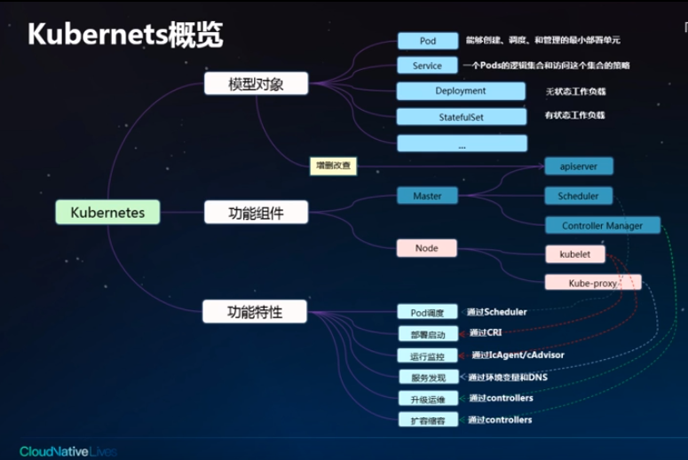
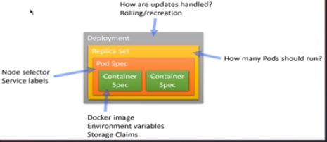
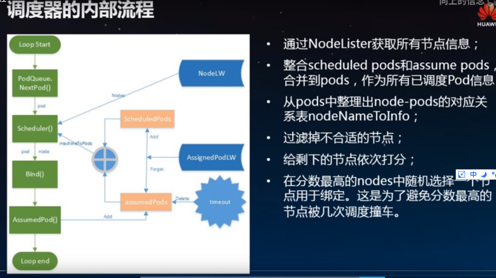

#Kubernetes视频学习笔记

标签：学习笔记 kubernetes

来源：[bilibili](https://www.bilibili.com/video/av40743487/?p=2)

## 2.K8s初体验

Service:Pods的逻辑集合，主要解决的负载均衡的问题。

功能特性：

* 服务发现，指在容器中如何获取别的应用的服务。通过环境变量或是通过DNS。
* 升级运维：主要通过controllers
* 扩容缩容：弹性伸缩。

### Pod

Pod的中文是豆荚。是能够创建、调度和管理的最小部署单元，是一组容器的集合。

Pod的容器共享同一个网络命名空间，IP地址和端口空间。

Pod中有三种容器：

* 基础容器：对用户不可见，维护整个Pod网络空间。
* 初始化容器，一般用于服务等待处理以及注册Pod。先于业务容器开始执行，顺序执行。
* 业务容器：并行启动，启动成功后一直Running。

容器的基本组成：

三类：

* 镜像部分：包含镜像地址和拉取策略(always保持最新，if not recent如果有相同版本可以不拉，never不拉)，还有拉取镜像的认证凭据
* 健康检查：业务探针（探针不正常后，不会重启容器，只会拿掉服务后端的endpoints，即负载均衡不会指定到该实例上）、存活探针（探测不正常后，会重启容器）
* 外部输入：环境变量（使用简单，Key-value型，配置文件或是从密钥中拿去）、配置文件、密钥（配置文件与密钥是挂载形式的，可以在不重启容器的情况下进行改变。Secret会进行base64加密）

Pod的持久化存储。

云存储：云硬盘、文件存储、对象存储。

服务域名发现：

dnsPolicy，在容器内访问域名地址该如何进行解析：

* ClusterFirst：使用kube-dns作为域名解析服务器（支持级联域名）
* Default：使用节点kubelet指定的域名服务器解析域名
* ClusterFirstWithHostNet：当Pod使用主机网络部署时使用。

### 工作负载与服务

工作负载通过label-selector相关联。

关键工作负载：ReplicaSet，副本控制器，可以控制Pod的实例个数。用于解决Pod的扩容和缩容问题。

Deployment：升级、回管的实现。

StatefulSet：与ReplicaSet对应，有状态应用。每个实例之间是可以相互访问的，且有唯一的网络标识。

DaemonSet：每种节点都会部署一个。

Job：一次性执行的，分为普通任务和定时任务。

CustomResourceDefinition，用户可自定义资源模型，需要自己实现controller来进行资源管理。

Pod与服务的关系：Pod与Service之间通过label-selector相关联

Service分为三类：

* ClusterIP：集群内部访问
* NodePort：集群节点相通
* LoadBalancer：公网访问

## 3.K8s工作负载调度原理剖析和实践

k8s让应用更易于从故障中恢复

workload，以Pod为基础的四种模式：

详见kubernetes学习笔记

## 4.k8s调度器原理剖析和实践

经典调度器处理的是Pod，输入的是待调度的Pod，将其调度到合适的节点。Pod的变化是spec的nodeName字段被填写。

原始调度器是一个队列式的调度器，一次只处理一个Pod。只能够做到调度时刻的最优。

### k8s调度策略和算法

两类调度策略：

* predicates：筛选动作，检查集群中的节点，滤去不合格的节点（检查硬盘、内存、端口），避免资源冲突、节点超载。
* priority：给剩余的Node评分，挑选出最优的节点。优化资源配置、应用分布。

 nodeAffinity用labelSelector过滤出符合条件的node。

 podAffinity与podAntiAffinity分别来指定pod之间的亲和和反亲和的关系。（硬性过滤会接受/排斥，软性过滤会影响分数）

 k8s的Pod内置了hostname这个label

 taints-toleration