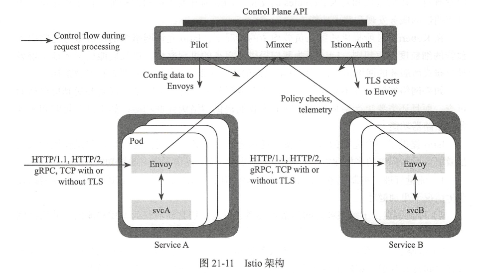
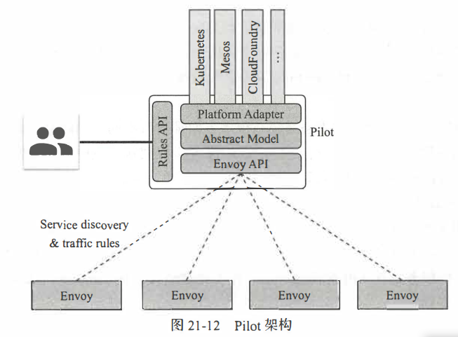

# Service Mesh学习笔记

标签：ServiceMesh Kubernetes 微服务 学习笔记

## 内容来源

* [Awesome Service Mesh](http://www.servicemesher.com/awesome-servicemesh)
* 浙江大学出版社-《基于Kubernetes的容器云平台实战》
* [Istio官方文档](https://preliminary.istio.io/zh/)
* [Istio Handbook](https://jimmysong.io/istio-handbook/)

## 基础知识

来自于对浙大那本书的学习

* 服务发现：自动查找哪些服务实例满足给定查询的过程。
* 断路器的实现：将一个受保护的函数调用包含在用于监视故障的断路器对象中，一旦故障达到一定阈值，则断路器跳闸，并且对断路器的所有后续调用都会返回某种错误。
* sidecar概念：与主程序一起运行，并为其提供额外的功能。

Service Mesh，国内翻译为服务网格，是一个基础设施层，功能在于处理服务间的通信。它提供了一个控制平面，实际的服务流量仍然是从代理流向代理，但是控制平面知道每个代理实例，使得代理能够实现诸如访问控制和度量收集这样的功能。这需要它们之间相互合作。

ServiceMesh的功能：

* 负载均衡：所有请求对于服务网格可见，因而可以通过提供高级负载均衡算法来实现更加智能、高效的流量分发，降低延时，提高可靠性。
* 服务发现：以微服务模式运行的应用变更非常频繁，IP地址也不会固定，服务网格提供了简单、统一、平台无关的多种服务发现机制，如基于DNS、K/V键值对存储的服务发现机制。
* 熔断。可能会有服务实例中断或者不健康导致服务中断的可能性，要求监控工具快速检测并从负载均衡池中移除。
* 动态路由：应用部署策略应该尽量从技术手段上达到无服务中断部署，一次避免变更导致的服务中断和稳定性降低。
* 安全通信：通过将安全机制如TLS加解密和授权实现在服务网格上，可以很容易地在整个基础设施层更新安全机制，不用对应用作任何操作。
* 多语言支持
* 多协议支持
* 指标和分布式追踪
* 重试和最后期限

### 服务发现

通常的服务发现机制：

1. 服务端向服务注册中心发起注册
2. 客户端到服务注册中心查询
3. 客户端根据查询返回的参数信息向服务端发起请求

服务网格的不同之处在于，客户端无需发送查询请求，而是直接向服务网格发起服务代理请求，由服务网格代理向服务注册中心发起查询请求，并根据请求结果进行数据请求路由。

### Linkerd

Linkerd是Service Mesh的第一代代表，用Scala编写，是业界第一个开源的Service Mesh方案。

### Istio

Istio是Google、IBM和Lyft开源的微服务管理、保护和监控框架。它提供了一种简单的方式来建立及部署服务网络，具备负载均衡、服务间认证、监控等功能，而不需要改动服务代码。

#### Istio架构

Istio在逻辑上分为数据平面和控制平面

##### 控制平面

控制平面负责管理和配置代理路由流量，以及运行时执行的政策

组件：

* pilot领航员：为Envoy Sidecar提供服务发现，为流量管理功能实现了灵活的路由和弹性。将高级别的路由规则转换为Envoy特定的配置并在运行时将配置传播到Sidecar中。
* Mixer混合器：Mixer负责在Service Mesh上执行访问控制和使用策略，并收集Envoy代理和其他服务的遥测数据。代理提取请求级属性，发送到Mixer进行评估。
* Istio-Auth：Istio-Auth提供强大的服务间和最终用户认证，使用TLS、内置身份和凭据管理。用于升级Service Mesh中的未加密流量，并为运营商提供基于服务身份而不是网络控制的策略的能力。

##### 数据平面

数据层由一组智能代理(Envoy)作为Sidecar部署、协调和控制所有微服务之间的网络通信。

Envoy是Istio的数据平面，是一个高性能的C++开发的proxy网络转发器，接管网格中所有服务的进出流量。

作为微服务的sidecar，Envoy与对应的微服务一起部署在一个Kubernetes的Pod中。在Istio模式下，一个Pod包含两个容器：服务容器和Envoy容器。

#### 流量管理

流量管理的核心组件是Pilot，它管理和部署所有Envoy代理的实例。

功能：指定使用哪些规则在Envoy代理之间路由流量，并配置故障恢复功能，如超时、重试和断路器等。它还维护网格中所有服务的规范模型，并使Envoy代理通过其发现服务来了解网格中的其他实例。

每个Envoy实例根据从Pilot获取的信息及其负载均衡池中其他实例的定期运行状况检查来维护负载均衡信息，从而使得其能够在遵循指定的路由规则的情况下智能分配目标实例之间的流量。

#### Pilot

数据面Envoy可以通过加装静态配置文件的方式运行，而动态信息需要从Discovery Service去获取。这个Discovery Service由部署在控制平面的Pilot来提供。

最下面那层Envoy API，就是提供Discovery Service的API。这个API的规则由Envoy确定，是Envoy主动调用Pilot的这个API。

Pilot上面那层被称为平台适配层，Pilot通过调用Kubernetes、Mesos等来发现服务之间的关系。使用k8s只使用其服务发现功能，而不使用其转发功能，它会在k8s里面注册一个Controller来监听事件，从而获取Service和k8s的endpoint以及Pod的关系，但是转发就不会用Kube-proxy的iptables了，而是使用自己的转发模型，下发到Envoy进行转发。

如此，控制平面和数据平面就彻底地分离开来，服务之间的相互关系是管理面的事情，不要与真正的转发绑定在一起，而是绕到pilot后方。

pilot的另外一个对外接口是rules API，这是留给管理员的接口。

#### 服务发现

pilot使用来自服务注册中心的信息并提供与平台无关的服务发现界面。Service Mesh中的Envoy实例执行服务发现并相应地动态更新其负载均衡池。服务网格中的各服务使用其DNS名称相互访问。

istio目前允许三种负载均衡算法：循环法、随机和加权最少请求。

## sidecar模式

[来源](https://jimmysong.io/istio-handbook/concepts/sidecar-pattern.html)

将应用程序的功能划分为单独的进程可以被视为sidecar模式。sidecar设计模式允许为应用程序添加许多功能，而无需额外的第三方组件配置和代码。

在sidecar部署模式，会为每个应用的容器部署一个伴生容器，用sidecar来接管进出应用容器的所有流量。在k8s的Pod中，在原有的应用容器旁边运行一个sidecar容器，可以理解为两个容器共享存储、网络等资源，广义上是一台主机。

## Istio流量管理

使用Istio的流量管理模型，本质上是将流量与基础设施解耦，让运维人员可以通过Pilot指定流量遵循什么规则，而不是指定哪些Pod/VM应该接收流量。

流量管理的具体定义：

* 控制服务之间的路由：通过在VirtualService中的规则条件匹配来设置路由，可以在服务间拆分流量。
* 控制路由上流量的行为：在设置好路由之后，就可以在路由上指定超时和重试机制，例如超时时间、重试次数等；做错误注入、设置断路器等。可以有VirtualService和DestinationRule共同完成。
* 显式地向网格中注册服务：显式地引入Service Mesh内部或外部的服务，纳入服务网格管理。由ServiceEntry实现。
* 控制网格边缘的南北向流量：为了管理进行Istio service mesh的南北向入口流量，需要创建Gateway对象并与VirtualService绑定。

### 基本概念

* VirtualService:在Istio服务网格中定义路由规则，控制流量路由到服务上的各种行为。
* DestinationRule：是VirtualService路由生效后，配置应用与请求的策略集。
* ServiceEntry：通常用于在Istio服务网格之外启用的服务请求。
* Gateway：为HTTP/TCP流量配置负载均衡器，最常见的是在网格边缘的操作，以启用应用程序的入口流量。
* EnvoyFilter：描述了针对代理服务的过滤器，用来定制由Istio Pilot生成的代理配置。（谨慎使用，错误地配置内容一旦完成传播，可能会使整个服务网格陷入瘫痪状态）

#### VirtualService

顾名思义，就是虚拟服务。VirtualService中定义了一系列针对指定服务的流量路由规则，每个路由规则都是针对特定协议的匹配规则。如果流量符合这些特征，就会根据规则发送到服务注册表中的目标服务。

#### Subset

subset是不属于Istio创建的CRD，但是它是一条重要的配置信息。

subset是服务端点的集合，可以用于A/B测试或者分版本路由等场景。

#### DestinationRule

DestinationRule所定义的策略，决定了经过路由处理之后的流量的访问策略。这些策略中可以定义负载均衡的配置、连接池的大小以及外部检测配置。

#### ServiceEntry

服务入口，Istio服务网格内部会维护一个与平台无关的使用通用模型表示的服务注册表，当你的服务网格需要访问外部服务的时候，就需要适用ServiceEntry来添加服务注册。

#### EnvoyFilter

EnvoyFilter描述了针对代理服务的过滤器，用来定制由Istio Pilot生成的代理配置。

#### Gateway

Gateway为HTTP/TCP流量配置了一个负载均衡，多数情况下在网格边缘进行操作，用于启用一个服务的入口(ingress)流量，相当于前端代理。

Gateway设置了一个集群外部流量访问集群中的某些服务的入口，而这些流量究竟如何路由那些服务上则需要通过配置VirtualService来绑定。

## Istio中的sidecar的流量路由详解

