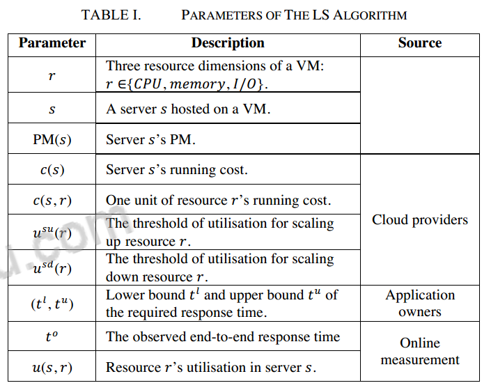
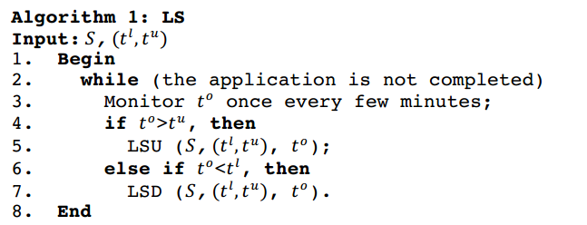
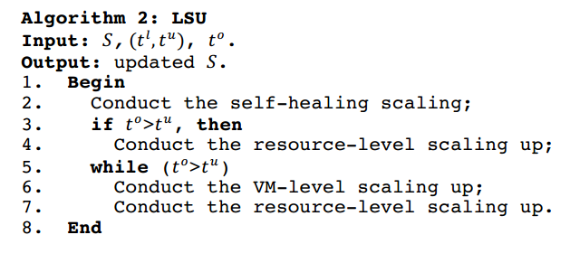
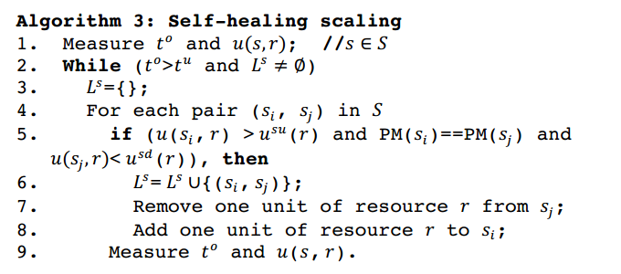
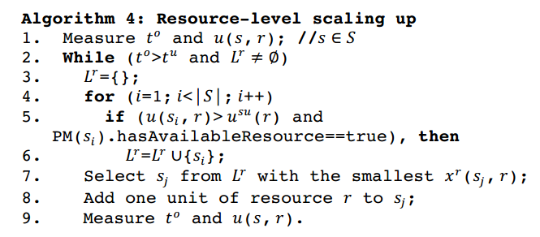
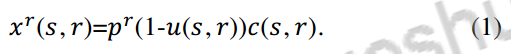
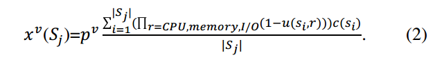
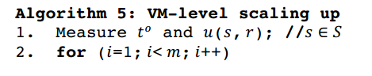
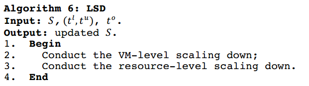

# light weight resource scaling for cloud applications

标签：论文 微服务 弹性伸缩 垂直伸缩 虚拟机 资源分配算法

会议：CCGrid 2012 RuiHan, Li Guo, Moustafa M. Ghanem, Yike Guo
From Department of Computing Imperial College London, UK

## 摘要

弹性资源保证是云计算的重要特性，它允许用户在运行时对他们的应用进行弹性的增长或减少。如今的弹性伸缩技术大多基于应用虚拟机实例的分配与释放。这些VM级别的弹性策略有些考虑过头了，而且有着额外的开销，特别是当应用有快速变化的需求的时候。

在本文中，我们采用了一种轻量的策略来允许开销敏感的弹性云应用伸缩。我们的方法更多的在资源层面进行工作而不是虚拟机层面（CPU、内存、IO等）。我们也设计并实现了对云应用的轻量级智能资源管理平台。我们认为自己的算法是适用于轻量伸缩与VM层面伸缩的，并展示他们的交集。最后，我们会用工业标准的分支测试来评估我们方法的有效性，并将它和传统的方法进行类比。

## 1.Introduction

因为许多在云环境上的网络应用往往面临着可以预测的剧烈的负载变化，所以基于需求的伸缩已经变成了云服务的一个重要特性。这个特性允许在线的请求和释放计算资源来调整应用的表现，以此达到QoS的要求，同时也可以尽量降低基础设施提供者的操作成本来保持竞争力。

大多数基于需求的资源伸缩是基于控制虚拟机的数量来实现的，然而使用VM作为分配的基本单元时，VM本身会消耗一部分资源，因此当VM的数量增长的时候，维护成本也就不断地变大。应用的需求不一定要改变VM的数量，只是改变VM的容量也可以达到要求。

实现的算法：

* Fine-grained scaling approach细粒度伸缩算法：一种新奇的轻量级算法，允许细粒度的对资源进行分配，包括CPU、内存和IO（LS算法）
* Improving resource utilisation高效的资源利用措施：LS算法提高了物理机（PM）的资源利用率，通过释放重复资源来减少浪费。
* Implementation and experimental evaluation：基于LS算法的智能平台，自动进行云上的伸缩过程。提出的这个轻量级方法会被工业标准的分支测试来进行检验，测试它的有效性是否满足QoS的要求且能够减少基础设施提供者的花费。

后面的组织格式：

* Section II，动机和背景
* Section III，相关工作的总结与概述
* Section IV描述了LS算法(lightweight scaling algorithm)
* Section V介绍了Imperial Smart Scaling engine的架构与我们方法的支持的实现
* Section VI，实验性检验
* Section VII，总结和讨论，与未来工作的展望

## 2.Motivation

流量的种类是不一样的，比如大量的ajax请求可能会使web server疲于奔命，但是mysql服务器是不受什么影响的。然而从服务拥有者的角度来说，整体的性能是受到影响的，因此需要去调用更多的资源到那些瓶颈组件上，从而保障整体性能不受影响。

我们轻量级伸缩算法的目标就是在资源层面上进行操控来平衡不同PM和VM之间资源的不平衡，提高资源的利用率而不是去增加新的实例。

从概念上，可以从两个方法上来实现lightweight scaling：

1. self-healing scaling，当两个VM是部署在同一个PM上，且一个VM的空闲资源可以被另一个VM使用时。
2. resource-level scaling，基于指定PM上的未分配资源来扩展一个VM。（比如一个CPU和内存使用率低的PM可以执行一个需要这些资源的VM，这样VM就可以得到充足的资源）

## 3. Related work

A. Scaling Techniques before Clouds

应用弹性伸缩其实在云技术出现之前就已经被研究了。关注重心的转义

B. Traditional Scaling Techniques in Clouds

过去的时候，许多云基础设施提供商会提供一些策略来帮助服务拥有者弹性伸缩自己的应用，通过手动或自动的方式。这些被提供的策略指定了每次弹性伸缩时服务器的数量变动上界和下界，且假设了这些服务拥有者拥有自己服务的对应知识从而能够自行定义合适的策略。

C. Lightweight Cloud Resource Management

## 4. The Lightweight Scaling Algorithm (LS算法)

### A. THE LS Algorithm Overview

算法1很简单，它描述了什么时候伸缩，依据什么样的指标。

现在，有一个m层的应用要加入到弹性伸缩中，有n个服务器组件。服务器集合S有n个服务器。伪代码在下面

算法在应用部署完毕后运行，直到应用结束。算法在观测到相应时间大于上界的时候会触发一个轻量弹性扩展(lightweight scaling up,LSU)，或者发现相应时间小于下界的时候触发一个轻量弹性收缩(lightweight scaling down,LSD)

### B. The LSU Algorithm

LSU算法的目的在于减少响应时间到上界$t_u$以下，同时尽量减少资源消耗和VM实例数量。

LSU算法执行三种弹性扩张策略，采用不同的优先级。self-healing和resource-level scaling首先通过增加虚拟机的容量来减少响应时间。（这两种伸缩是有约束的，它们不能超过虚拟机所在的宿主物理机的限制）

如果响应时间上界仍然过高，则选择增加VM实例数量并在资源层面上进行调整。

#### self-healing scaling

需要注意到，self-heaing scaling的核心要点在于两台调度的VM要处于同一台PM上，因此使用了一个候选者列表$L^s$来存储VM可以修改的服务器对。一对合格的服务器$(s_i,s_j)$必须满足：从属于同一个应用，运行在同一个PM上，且$s_i$的VM要有至少一项资源$r$超过上界，且$s_j$的VM中对应的资源小于下界。

这样，从$s_j$中取一单位的资源$r$给超载的$s_i$虚拟机就可以缓解响应时间超界问题。

算法会一直执行下去，终止条件是相应时间符合要求或者没有合适的虚拟机对。

#### resource-level scaling up

resource-level scaling up，在算法中，服务器$s_i$必须要用尽某种资源$r$（资源使用率高于弹性扩展上界），且VM所在的PM要有足够的该资源。扩展操作将所有合适的服务器放入到列表$L^r$中，如果有多个服务器存在于$L^r$中，准则$x^r(s,r)$就会用来选择服务器$s_j$并扩展该资源$r$

定义1(Resource-level scaling criterion $x^r(s,r)$)

该准则用来在resource-level scaling中选择服务器，是一个正常数$p^r$与服务器剩余资源和花费的乘积。因此LS算法4的目的是选择一个剩余资源最小的服务器$s_j$，并向其中添加资源。

#### VM-level scaling up

VM-level scaling up用来作为上面两种扩张策略的补充，同时也是触发的所有策略中优先级最低的一种。策略使用准则$x^v(S_j)$来检测第j层的瓶颈来决定是否增加服务器。

定义2 VM-level scaling criterion $x^v(S_j)$，包含两个变量：1. 服务器在第j层的使用度(exploitable ratios)，这是它的三种资源（内存、CPU和IO）的使用度的乘积，用来代表$s_i$的剩余容量。2.第j层服务器的运行代价。

VM-level scaling up就使用准则$x^v(S_j)$来选择第j层剩余最小的资源，用最小的代价来增加一个服务器。换而言之，在这一层上增加服务器应该能够减少每个虚拟机单位上的响应时间，同时花费的代价要是最小的。

### C. The LSD Algorithm

LSD算法意图从一个服务中移除尽量多的VM和资源，同时保证其响应时间不会发生太大的变化。

首先用定义2中的$x^v(S_j)$来确定瓶颈，查看是否可以移除虚拟机。这个移除的目标是保证减少的代价与增加的响应时间的比值最大。这个步骤将一直持续到不能进行为止。

然后将进行资源层面的调整，使用准则1来判断是否进行资源r的移除。

## 我的总结

### 老师论文总结的要求

找不到地方记了，先写在这里吧

* 论文题目、论文作者以及单位、发表期刊信息（期刊名称/会议名称以及地点，卷、期、页码，年、月）
* 技术问题：详细描述论文解决的问题。输入/输入（我认为还是要抓住重点）
* 现实背景：描述技术问题出现的典型现实场景，可举例说明
* 作者思路：简要（3句话以内）总结作者解决问题的思路，简单易懂
* 解决方案：描述作者问题解决方案的详细步骤
* 创新贡献：描述解决方案中关键的创新点。
* 效果评价：分析解决方案的效果，优点、缺点、约束条件。
* 个人观点：个人对论文的评价、观点以及改进想法。

### 简要总结

感觉好像用不上详细总结，明天听完师姐的报告在考虑要不要写吧，毕竟事情还是有点多。

技术问题：面对负载变化快速的应用，产生一种垂直伸缩算法来减轻水平伸缩带来的高消耗，同时使得应对更加快。

算法的思路：总体来说就是一个水平伸缩与垂直伸缩的结合，优先考虑垂直伸缩，垂直伸缩不能解决问题的时候再考虑水平伸缩。

效果：从测试的结果上来说，开的服务器数量确实是有减少的，整体的资源消耗也减少的比较多，花费也确实少了点，应该说效果是很好的。但是它对比的对象也太low了，PBS(Policy-based scaling algorithm)和TDS(tier-dividing scaling algorithm)都称不上是智能算法这一层面，我觉得取得这样的成绩应该是理所应当的吧。（话说这个算法号称智能平台是在什么地方，因为有多于一种选择性吗）