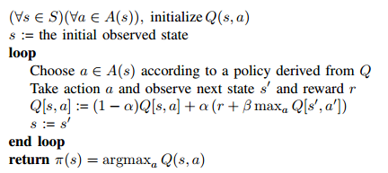
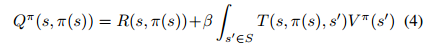
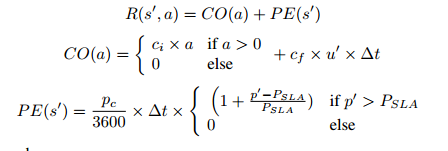
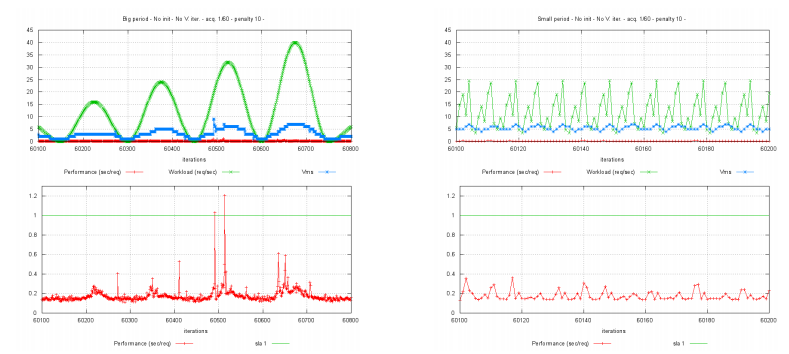
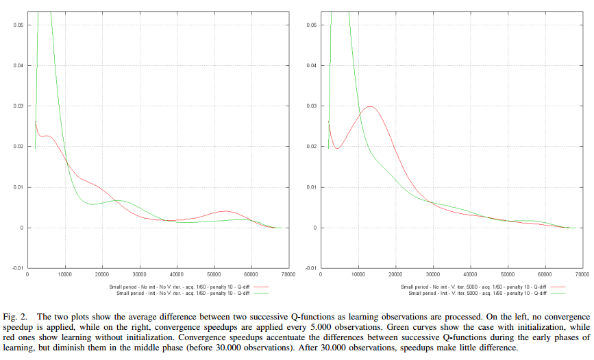
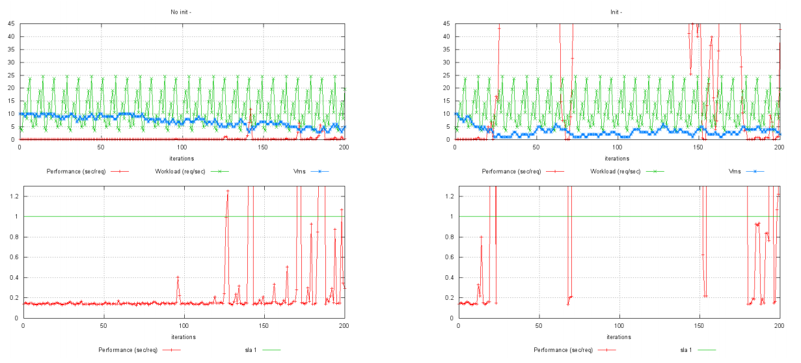
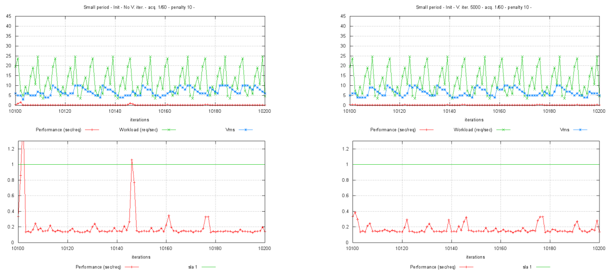
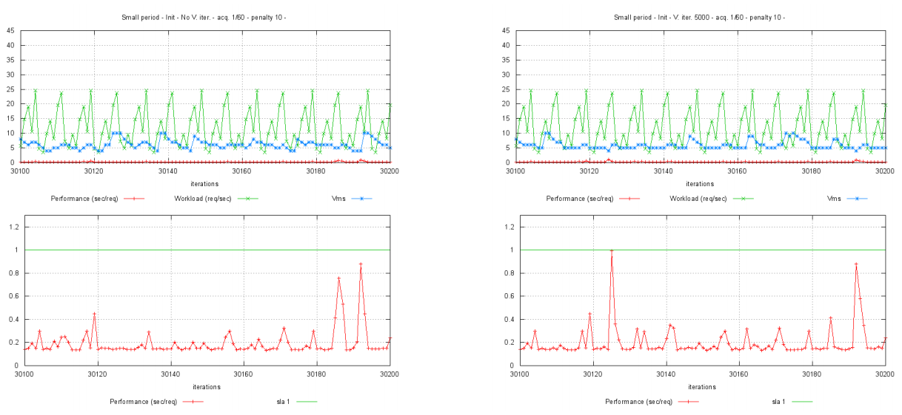

# Using Reinforcement Learning for Autonomic Resource Allocation in Clouds: Towards a Fully Automated Workflow

标签：论文阅读 弹性调度 强化学习

会议：ICAS 2011， The seventh International Conference on Autonomic and Autonomous Systems

## 下文组织

1、背景，就是作者陈述的问题是在一个什么背景下会出现的；
2、动机，就是作者为什么要解决这个问题，是这个问题很新颖，其他人没做过，还是现有的解决方案还不那么让人满意？那么现有的解决方案对这个问题的解决程度到哪里了？；
3、作者为了解决这个问题，提出了什么方案（就是他的思路和特点）；他的方案有哪些优势；主要的贡献有哪些？
4、作者对这个问题是怎么描述的，例如他是通过案例来阐述，还是直接给定义；还是通过其他方式
5、作者在相关工作里面是怎么组织的？例如是按时间顺序，还是分门别类，还是其他方式；
6、作者的方法（详细的）是如何的；
7、他的实验是如何的，输入和输出是哪些；有没有对比验证？他为什么要这么设置实验，为什么要与其他作对比（如果有的话）；他的实验有没有不足的地方
8、他的结论是什么，是如何与第一节section1的内容相互呼应，形成闭环的

* 问题定义：将文字描述落实到数学模型。
* 问题描述：目标是什么，解决了什么样的问题

## 背景

主要源自介绍部分

web应用目前越来越有24/7(7天，每天24小时)的趋势，因此需要提供一种在线的策略来平衡虚拟机的性能与花费的关系。（个人理解）具体的来说，就是在性能不足的时候添加虚拟机，在性能过剩的时候删除虚拟机。

## 动机

工业界使用了ad hoc手动决策策略，比如基于阈值的策略。这些策略使用一个较高的阈值作为增加虚拟机数量的触发器，一个较低的阈值作为收缩虚拟机个数的触发器。这些策略的问题：好的阈值设置需要设置者有高超的技巧，而且很难去自动适应每一个应用的需求。特别是需要为所有的状态找到合适的触发器时，这个问题特别的明显。

## 作者的方案

提出了使用增强学习来实现自动的决策机，对虚拟机的调度问题进行决策。

方案的优势：强化学习不需要应用表现模型的归纳知识，而是会在应用运行中进行学习。

主要的贡献：解决了强化学习应用于实际的三个主要问题：1. 初始值设定问题；2.加速收敛的效果。3.对流量模型变化的动态检测。

即使上面有些部分在强化学习领域已经有公认的解决方案，本文仍然在将这些策略整合进真实的云平台调度器中作出了贡献，并且将它们整合成了自动化工作流的一部分。

## 作者对这个问题的描述

案例？定义？其他方式

在Section-II进行了描述，对网络应用遇到的影响其性能的负载情况进行了枚举：需要处理大规模震荡负载，而且遇到的情况可能不可预测，因此需要响应式的自动调节系统。本文注重于PaaS和IaaS层的资源弹性调度问题。

描述：以最小的花费维持表现p(使用请求的平均等待时间)与SLA定义的目标P尽可能的接近。

## 作者在相关工作里的组织

基本按照解决问题的类型进行的分类，但是并没有严格地进行划分。

## 作者的方法是怎么使用的

详细

用Markovian decision processes(MDP)对资源分配建模，MDP中包含如下状态：

* MDP状态集合S，由（w,u,p）三元组定义，其中w为负载，使用每秒请求数作为衡量标准；u为当前应用分配虚拟机的个数；p为表现，用请求的平均响应时间反应。
* 动作集合A，包括添加、维护和删除虚拟机。最小-1台，最大10台。
* T是概率分布函数，指选定状态s和a分配到新状态s'的概率
* R是未来期望函数。概率分布函数P(r|s,a)表示在状态s和动作a的情况下期望奖励r的概率
* $\beta$，折扣率，用于帮助收敛，这里取0.45

T和R如果被事先决定的话，则可以直接使用DP来找到最佳策略。算法为value iteration algorithm。Value Iteration算法通过允许误差内连续的近似来实现。

然后使用Q-learning算法求解：因为T和R难以估计，所以使用平均值来作替代

其中学习率$\alpha$=0.8，内层循环使用value iteration算法来更新Q(s,a)的值

对于强化学习的三个问题的解决方案：

1. 更好地初始值。使用等式4进行初始值设定，用状态的value function V(s)和选定动作pi(s)来对Q(s,a)进行估计。

2. 收敛加速。考虑到Q(s,a)的更新在Q-learning中是顺序的，所以可以从统计学角度用大量的连续数据估计出R和T，然后直接算出Q(s,a)。估计使用的是平均数。最终估计出的R和T用来更新V，然后更新当前的Q(s,a)

3. 模型变化检测。方法是使用之前收集到的数据来做假设检验，检验R和T是否变化高于置信度。

## 作者的实验

输入输出、对比验证

为什么这么设置实验，为什么要与其他作对比

他的实验有什么不足的地方

reward function的定义

其中CO代表了需求和租赁虚拟机的费用，PE代表了目标性能被违背时的惩罚。

### 实验1

实验1对两种工作负载情况进行了对比，验证了在不同的负载情况下算法都会收敛(原文: It shows the policies that have been obtained at convergence given two different workload patterns)

实验的输入为模拟的工作负载，输入的第一种信号为逐渐增大的长周期正弦信号，第二种信号为带噪声的短周期正弦信号。输出为VM的个数与请求的平均等待时间。

实验的目的是为了验证算法在不同模式的工作负载下的运行情况，第一种比较简单，属于强化学习比较容易识别的类型；第二种更接近于真实负载情况。

不足的地方在于，从表现上来看，他的算法对于比较简单的第一种情况表现不是特别好，有违反SLA的情况。反而是对于比较复杂的第二种情况等待时间一直维持在较低水平。

### 实验2

实验2

实验的输入为工作负载，输出为当前状态Q(s,a)的值

左边为没有使用加速的，右边为使用了加速的。绿色的是使用了初始值的，红色的是没有使用初始值（Q=0）

实验的目的是对比是否采用合适初始值对Q(s,a)收敛的影响，与是否采用收敛加速对Q(s,a)收敛的影响。

从结果上来看，在30000次观察以后，两边的效果就十分接近了。

实验的不足在于收敛加速似乎并没有效果，虽然左侧会在中途有一些起伏，但是最终收敛情况其实十分接近。初始值的效果倒是还可以，需求上需要Q(s,a)在开始的时候足够大来作出选择，然后尽量快的收敛。

### 实验3

实验的输入为工作负载情况，输出为VM数量与服务器的平均等待时间。

左侧为没有使用初始值，右侧为使用了较好的初始值。两者均无进行收敛加速，可以看到左侧在后期对SLA有较多的违背，而右侧大量违背SLAVE，且响应时间几乎为无响应。

作者的解释为奖励函数完全抵消了违背SLA的惩罚项。实验的不足在于这里的问题似乎并没有得到明确的说明，虽然从后面的实验来看这个问题应该是被解决了的。

### 实验4

实验过程：每5000次观测执行一次收敛加速。

左侧为没有使用收敛加速，右侧为使用了收敛加速，从效果上来看右侧的响应时间要更平稳，比左侧更好。作者的原话是开始的时候，初始化策略的影响比较大，所以没有截下来。到中间，也就是10000次迭代左右，可以看到加速迭代让模型更贴近与实际。在最后，也就是30000次迭代时，两者几乎没有差别。

实验不足：每5000次执行一次收敛加速，那么第一次执行收敛加速前后的对比是不是放出来会更好。而且作为响应式方法执行了10000次迭代是否有过久，每一次迭代执行的时间这里是没有交代的。（实验中提到决策间隔为40s，但是并没有提到观测间隔）

## 作者的结论

强化学习在提供资源的自动应对方案上很有前途，但是需要对云上的自适应需求进行小心且专业的处理。这里指的是给强化学习的学习函数一个好的初始值与加速其收敛。

形成了逻辑闭环，第一部分着重提及了强化学习所面临的三个问题，但是只解决了两个问题，还有一个问题其实文中并没有太多的提及，总结上说他们在云平台上进行了实现，但是并没有进行相关的实验。