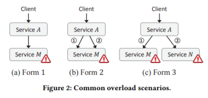
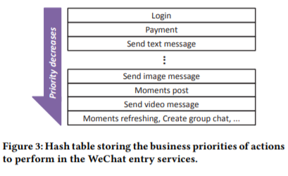
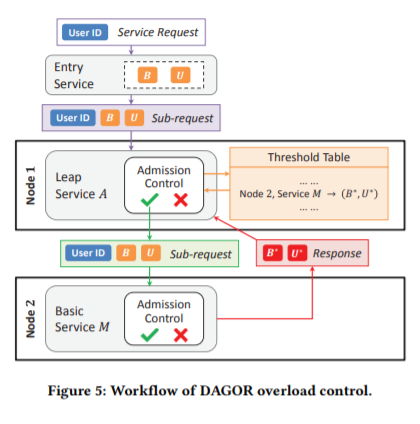
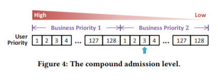
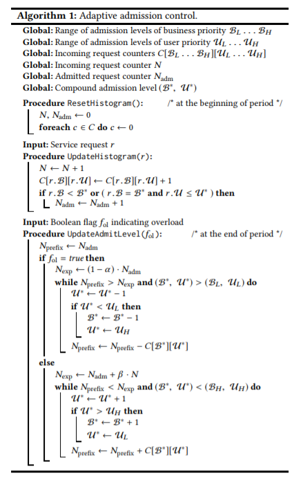
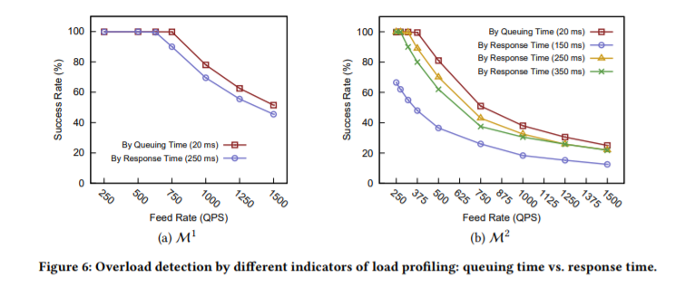
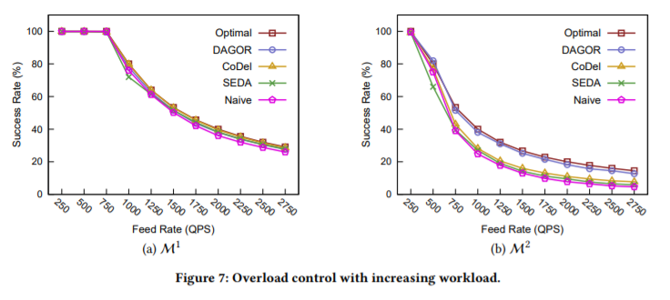
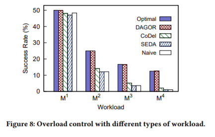
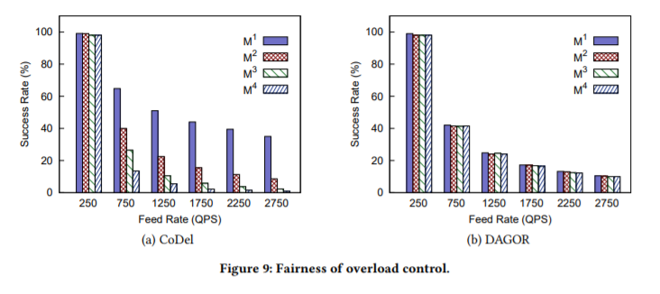

# DAGOR：微信“大规模微服务过载控制系统”

标签：微信 DAGOR 微服务 过载控制

[英文原文](https://arxiv.org/pdf/1806.04075.pdf)，中文译文见微信公众号：微信后台团队

## 论文阅读要求

* 论文题目、论文作者以及单位、发表期刊信息（期刊名称/会议名称以及地点，卷、期、页码，年、月）
* 技术问题：详细描述论文解决的问题。输入/输出（我认为还是要抓住重点）
* 现实背景：描述技术问题出现的典型现实场景，可举例说明
* 作者思路：简要（3句话以内）总结作者解决问题的思路，简单易懂
* 解决方案：描述作者问题解决方案的详细步骤
* 创新贡献：描述解决方案中关键的创新点。
* 效果评价：分析解决方案的效果，优点、缺点、约束条件。
* 个人观点：个人对论文的评价、观点以及改进想法。

## 数学建模尝试

### 符号定义

* Range of admission levels of business priority 面向业务的准入控制取值范围 $B_i$,i=1...128
* Range of admission levels of user priority 面向用户的准入控制取值范围 $U_j$,j=1...128
* Incoming request counters $C[B_i][C_j]$ 到来的服务包次数计数
* Admitted request counter $N_{adm}(t)$ 表示t时刻服务器k的准入请求数量
* Compound admission level(B*,U*) 当前服务器所进行的复合的准入控制

### 详细声明

#### 流量环境定义

服务器每秒请求数req QPS

#### 成功率定义

服务器上所有服务的成功率是相同的，仅取决于有多少个服务被接收。单次调用成功率 = 多次调用成功率（基本等同，证明暂略）

特点，对于服务A，其成功率等于它回复上游服务的请求总数/上游服务所有发往它的请求总数

有公式：服务A允许接受地上游服务的请求总数 = 回复上游服务的请求总数+被下游服务拒绝的请求总数。如果没有下游服务，则接收上游服务的请求总数就等于回复上游服务的请求总数

可以使用little's law证明，在服务处理速度不变，时间不变的情况下，单位时间内可以通过队列进入服务内部的请求数量是有上界的。

对于整个模型的目标，就是在当前的流量条件下尽可能最大化服务成功率。因此相同的流量条件下，发往服务的请求总量不变，此时成功进入队列的量就等于上游服务收到的量（不考虑网络服务丢包）。因此想要服务的调用成功率最大，本质上就是使得进入队列的流量数量最大。假定服务器本身处理请求的速度是恒定的，这时候会得出一个服务的最大速率，因此算法的目的就是尽量保证服务维持在最大速率上。

对于有下游服务的情况，因为被下游服务拒绝的请求数量无法估计，可以看作是一个随机的数。这种情况比较复杂，没有想好。从定量分析的角度来说，要想服务成功率最大，这时候需要增加进入队列的流量总数，同时最小化下游服务的请求拒绝量。由于上面那种情况已经假设服务器处理请求的速度是恒定的，这时候进入队列的流量总数必定有上界，因此算法同时应该保证下游服务的请求拒绝量尽量的小。考虑到下游服务的请求拒绝量 = 请求总量 - 请求接受量，而请求总量是恒定的，这时候也即请求接受量尽可能的大。

总而言之，算法的目标是最大化服务调用成功率，等价于最大化当前流量条件下的请求接受量

按照原文描述，成功调用服务A，意味着上游服务发给A的请求，收到了A的正确回复。

因此，服务A的成功率可视作服务A发给上游服务的请求总数除以上游服务发给服务A的请求总数。即$successRate = C_{ans} / C_{total}$

而服务A发给上游服务的请求总数等于服务A的实际处理准入流量-下游服务拒绝流量$C_{ans} = C_{solve} – C_{refuse}$

服务A的实际处理流量可以用排队论的little’s law来计算

#### 成功率推导

目标是过载时，如果需要最大化服务成功率，需要一定程度的降低请求接受量到一定程度（可能要满足实际处理速度，大概）

根据littls's law，$q = \lambda R$，即队列的平均长度等于队伍的处理速度乘以排队时间 

而由MM1推导出$R=\frac{1}{\mu - \lambda}$，即排队时间等于服务处理速度和排队处理速度的差的倒数。

假设服务处理速度$\mu$是一个常数，可以推出服务处理速度与排队速度的关系$\frac{\mu}{\lambda} = \frac {q+1}{q}$

原文有提到，排队时间与排队时间与超额的工作负载成正比。这里定义超额的工作负载为除了服务正常处理之外的请求，即排队中的请求。因此排队时间就与队伍长度成正比（废话）

原文有提到，排队时间与超额工作负载成比例增加。对于DAGOR而言，所有不在准入控制范围内的请求均为超额工作负载。这里将成比例增加作为线性模型进行建模，有

$R = \theta(C_{total} – N_{adm})+const$

所以当服务器过载时，显然总流量会显著地大于准入控制数量，因此一定会有$C_{total}>N_{adm}$，增加准入控制请求的数量能够减小排队时间。

当服务器没有过载时，此时超额工作负载应该为0，因此按原文的说法，排队时间应该为一个常数const。

#### 过载检测定义

过载检测使用请求的排队时间，定义：请求到达服务器与其在服务器上被启动处理之间的时间差来衡量。

可以使用排队论中的Little's law，$L=\lambda * W$，代表着系统内个体数目的平均值=个体到达率*个体平均逗留时间，排队时间W可以用短时间内请求队列的长度除以到达率。

总而言之，定义时刻a服务器k的排队时间为$tq^k(a)$

作为对比的响应时间没有给出具体的定义，但是由于算法是基于单个服务器粒度的，因此可以认为是本服务器收到请求后开始计时，一直到本服务器收到回应回复后停止计时。

#### 监控窗口的定义

监控窗口的大小$t_m=min(\epsilon,\frac{c_{max}}{v})$其中v表示服务器处理请求的平均速度，c_max为监控窗口内最大请求数2000。epsilon为监控间隔1s。

处理请求的平均速度用当前1s内总请求数量$q_t$除以当前时间$t_t$，$v=\frac{q_t}{t_t}$，原则上每秒钟清空。

推理过程：监控窗口为1s或2000次，因此每秒处理请求超过2000次时就使用固定次数作为监控窗口，此时处理2000次作为时间窗口等同于平均速度下处理2000次所用的时间。

#### 服务准入控制的定义

使用直方图$C[B_i][U_j]$表示当前的直方图，其中B和C表示业务准入控制级别和用户准入控制级别。使用$(B^*,U^*)$作为服务器当前接受的服务准入级别，$B^*,U^* \in [1,128]$

#### 约束条件的定义

排队时间设定上界$t_{qm}$，超过排队时间，服务器即视为超载。

论文的目标就是在服务器超载的时候最大化服务的成功率，并且兼顾组合负载的公平性（多次调用过载应用不能够过多的影响服务的成功率）

#### 具体算法的实现

已经知道a时刻接受的请求总数$N_{adm}(a)$，收缩系数$\alpha = 5\%$，放大系数$\beta = 1\%$

在a时刻的下一个监控窗口，如果服务器k发生了超载，即$tq^k(a+t_m)>t_{qm}$，这时候服务准入级别重新调整为使得服务请求总数不大于已经接受请求总数乘以某个系数的上界$N_{adm}(a+t_m) = N_{adm}(a)*(1-\alpha)$，此时有新的准入级别$\sum_{i=1}^{B^*-1}(\sum_{j=1}^{128})C[B_i][C_j] + \sum_{j=1}^{C^{C*}}C[B_{B^*}][C_j] \leq N_{adm}(a+t_m)$

如果没有发生超载，即$tq^k(a+t_m)>t_{qm}$，这时$N_{adm}(a+t_m) = N_{adm}(a)*(1+\beta)$，此时有$\sum_{i=1}^{B^*-1}(\sum_{j=1}^{128})C[B_i][C_j] + \sum_{j=1}^{C^{C*}}C[B_{B^*}][C_j] \geq N_{adm}(a+t_m)$
## 基本信息

* 论文题目：Overload Control for Scaling WeChat Microservices（DAGOR：微信“大规模服务过载控制系统”）
* 论文作者：Hao Zhou, Ming Chen, Qian Lin, Yong Wang, Xiaobin She, Sifan Liu, Rui Gu, Beng CHin Ooi, Junfeng Yang
* 单位：Tencent Inc. in China, National University of Singapore in Singapore, Columbia University in New York USA
* 会议：2018 ACM Symposium on Cloud Computing (SoCC)，October 11-13,2018, Carlsbad, CA, USA(CCF计算机体系结构/并行与分布式计算/存储系统B类会议最后一个)

## 技术问题

### 论文解决的问题

如何建立一个大规模负载控制的系统。确切地来说，对于如图中Form2和Form3这种情况，称为组合负载。有点类似于数据库中的事务，组合负载调用成功当且仅当所有的下级负载被调用成果。论文解决的问题是在高负载情况下如何成功保证组合负载的调用与普通负载相同。由于形式1和形式2在微信业务系统中占主导地位，因此组合负载和普通负载都是很常见的。

### 遇到的问题

1. 发送到微信后端的服务请求没有单一的入口点，因此全局入口点集中式负载监控是无法进行的。
2. 一个请求可以通过复杂的调用路径来调用多个服务，即使对于相同类型的请求，调用路径也可能不同，取决于请求的数据和服务参数。问题：不可能精确地确定应该丢弃哪种请求来减轻过载的情况。
3. 在分布式系统中采用去中心化控制。问题：浪费资源，关键是服务响应的高延迟影响用户体验，特别是组合过载时情况更加严重。

### 问题的输入、输出

* 输入：大量web请求造成的大规模微服务负载，包括普通负载和组合负载的处理
* 输出：按预设优先级对于每种请求，在其响应时间内进行响应，优先满足高优先级的服务。

## 现实背景

### 组合过载场景

组合过载的定义：存在多个过载服务，或者单个过载服务被关联的上游服务多次调用的过载场景。

* 一种服务重复调用另一种服务：加密/解密应用程序中，服务A首先可以调用服务M来解密某些数据，然后在本地操作明文数据，最后再调用服务M来加密最终数据。
* 一种服务调用两种或以上的服务：

微信的服务很多，其优先级如下：

可以看到，优先级高的服务，包括登陆、支付等都涉及到了大量的加密、解密运算，也就是组合过载的常见场景。

为什么要重点考虑组合过载？因为组合过载优先级高，但是普通情况下成功率较低。而且组合过载可能会出乎预料地大大降低系统吞吐量。比如图2.b中的形式2，A调用C两次，如果这时候发生过载，拒绝可能性为50%，因为A发送的C个任务，2C个调用请求，最终只有0.25个C的请求被接受。一旦被拒绝，A会在一定次数内重发被拒绝的请求，这就会进一步加大负载。总而言之，组合过载会使得服务A的成功率非常低。

因此组合过载是微信大规模微服务过载中必须要优先考虑的问题。

### 大规模微服务负载场景

微信每天的入口服务请求总数在10的10到11次方间，因此微信后端每秒基本上要处理数亿个服务请求，在业务系统中容纳了3000个运行在20000台机器上的服务。而且随着微信的发展，微信的微服务系统在经历着快速的迭代，在2018年3月到5月，平均每天经历了近千次变更。从经验来说，任何集中式或者基于SLA的过载控制机制都很难支持如此大规模的快速服务变更。

同时动态工作负载波动很大，普通时期的高峰时间请求量会比日平均请求量大3倍左右，在个别情况下，如农历新年时，高峰期工作负载会达到日平均工作负载的10倍左右。而且过量配置物理机器用来承受如此巨大的工作负载波动是很不经济的。相反，通过仔细设计过载控制机制，使其能够自适应地容忍系统运行时的负载波动。

## 作者思路

简要（3句话以内）总结作者解决问题的思路，简单易懂

1. 建立了面向业务的准入控制和面向用户的准入控制为基础的二元服务准入控制系统来为每个服务赋予优先级，且优先级继承而不可更改。
2. 服务器通过设定好的算法自适应地调节允许提供服务的优先级以保证请求的等待时间在阈值范围之内，从而保证服务器在高负载情况下正常工作。
3. 下游服务会向上游服务更新自己的准入级别，上游服务会直接拒绝向该下游服务发送不符合准入级别要求的服务请求。

## 解决方案

1. 当一个用户请求到达微服务系统时，它将被路由到相关的入口服务。入口服务将业务和用户优先级分配给请求，所有后续的对下游服务的请求都继承被封装到请求头中的相同优先级。
2. 每个服务根据业务逻辑调用一个或多个下游服务。服务请求和响应通过消息传递。
3. 当一个服务接受到一个请求时，它根据当前的准入级别执行基于优先级的准入控制。服务根据负载状态定期调整其准入级别。当服务打算向下游服务发送后续请求时，它根据存储的下游服务准入级别执行本地准入控制。上游服务只发送本地准入控制所允许的请求。
4. 当下游服务向上游服务发送响应时，它将其当前的准入级别附加到响应信息中。
5. 当上游服务收到响应时，它从消息中提取准入级别的信息，并更新下游服务在本地的相应记录。

### 过载检测

DAGOR使用的是等待队列中的平均等待时间，或者说排队时间，来检测过载。排队时间是请求到达服务器与其在服务器上被启动处理之间的时间差来衡量。

#### 与响应时间的对比

响应时间包含了额外计算请求处理时间。特别地，基础服务请求的时间纯粹由本地处理决定，而中转服务请求的处理时间进一步涉及到处理下游服务请求的耗时。此时，响应时间会被**递归地**测量。只要下游服务器的响应时间增加，上游服务的响应时间就会相应地增加，从而发生过载误报。

而与之相反，排队时间只受本地服务器处理能力的影响。当服务器由于资源耗尽而过载时，排队时间与超额的工作负载成比例增加。另一方面，如果服务器有足够的资源来消费传入的请求，排队时间会被维持在一个较低的水平上。

我的理解：响应时间是调用链级别的过载衡量，而排队时间是更细粒度的服务器级别的过载衡量。（因为DAGOR是分布式系统，所以每个服务器要知道自己的过载情况）

#### 与CPU利用率的对比

高负载不一定过载，只要服务器能够及时地处理请求，即使CPU利用率高，也不能认为它过载了。

#### 具体实现

基于窗口的，窗口约束是固定的时间间隔与该时间间隔内的一个最大请求数组成的。微信上采用的是1秒的时间间隔内，后者每秒2000次请求刷新一次平均请求排队时间的监控状态。

优点：在工作负载动态的情况下，监控可以跟上负载的变化。

过载检测上，每个服务任务的默认超时值为500ms，表示服务器过载的平均请求排队时间阈值为20ms。

### 服务准入控制

#### 面向业务的准入控制

微信业务按照业务意义和用户体验的影响进行内部优先级排序，为每个用户请求分配一个优先级，并强制所有后续请求继承相同的优先级。服务过载时，减载策略就是优先放弃低优先级请求。

由于同一调用路径的服务共享相同的业务优先级，因此对于下游服务而言，不用考虑设定优先级的问题，可以将面向业务的准入控制当作黑盒来应用。

实现上，高优先级的部分被预先定义并存储在哈希表上，哈希表被复制到负责入口服务的所有微信后端服务器中。（哈希表中只包含几十个条目，而微信入口服务多达数百个）

#### 面向用户的准入控制

面向业务的准入控制假设相同优先级的请求要么全部被接受，要么全部被放弃。这时候，容易出现服务器准入优先级波动导致某一业务优先级被事实上放弃。（业务优先级为a，但服务仍然过载，所以放弃所有业务优先级为a的服务。然而此时服务器又处于低负载状态，于是准入级别又设定为a，如此循环，a优先级被事实上放弃）

为了应对这种情况，提出了面向用户的准入控制作为面向业务的准入控制的补偿。准入服务通过一个以用户ID为参数的哈希函数动态生成用户优先级，每个准入服务每小时更改其哈希函数。因此，来自同一用户的请求可能在一小时内被分配到同一用户优先级，但是在不同时间段内被分配到不同的用户优先级。

优点：每小时内获得相对一致的服务质量，同时哈希函数交替考虑了用户的公平性。

这样也利于消除服务过载，比如对于第二种情况，一旦A通过了M的过载，A的后续请求就很可能得到成功的响应。

#### 自适应准入控制算法

思路有点类似于TCP的阻塞控制算法的思路，每次增加一小部分，超载的时候回退一大步。

自适应准入控制算法使用的是面向业务和面向用户混合的准入控制，优先考虑面向业务的优先级，在面向业务的优先级相同时再考虑面向用户的优先级。

为了提高自适应准入控制的效率，DAGOR采用了一个请求直方图，以此来快速计算出负载状态的准入级别设置。特别地，每个服务器维护一个计数器数组，每个计数器对应(B,U)索引的复合准入级别，计算与对应的业务和用户优先级相关的已接收请求的数目。

DAGOR会周期地调整减载的准入级别并重置计算器。在每个周期，如果检测到过载，服务器将在下一周期的期望传入请求量下调5%；否则，将请求数上调1%。

#### 协同准入控制

显然，存在这样一些请求，它们注定被下游过载服务器丢弃，并且下游服务器还要再通知上游服务器以拒绝该请求，这不仅浪费网路带宽，还会消耗过载服务器的过载资源。

下游服务器将其当前的准入级别(B,U)附加到它发送给上游服务器的每个响应信息中，以此让上游服务器了解到其最新的准入级别。这样，上游服务器会在本地拒绝掉那些注定要被下游服务器丢弃的请求。

### 过载工作流程

1. 当一个用户请求到达微服务系统时，它将被路由到相关的入口服务。入口服务将业务和用户优先级分配给请求，所有后续的对下游服务的请求都继承被封装到请求头中的相同优先级。
2. 每个服务根据业务逻辑调用一个或多个下游服务。服务请求和响应通过消息传递。
3. 当一个服务接受到一个请求时，它根据当前的准入级别执行基于优先级的准入控制。服务根据负载状态定期调整其准入级别。当服务打算向下游服务发送后续请求时，它根据存储的下游服务准入级别执行本地准入控制。上游服务只发送本地准入控制所允许的请求。
4. 当下游服务向上游服务发送响应时，它将其当前的准入级别附加到响应信息中。
5. 当上游服务收到响应时，它从消息中提取准入级别的信息，并更新下游服务在本地的相应记录。

## 创新贡献

创新点：

1. 使用排队时间而不是响应时间或者CPU利用率来作为过载指示。
2. 过载控制技术大多是为了传统的单一架构服务所设计的，DAGOR是第一个专门解决大规模微服务体系结构过载控制问题的方案。
3. DAGOR是服务无关的，是非侵入式的过载控制，而不像传统的集中式流量控制，或者采用FIFO但是牺牲了代价。
4. 采用了基于应用和基于用户的双重准入，而不是传统的基于回话的准入控制。

## 效果评价

### 过载检测

### 服务准入控制

### 公平性

优点：从上游服务调用成功率的角度，DAGOR基于排队时间的过载检测要显著地优于基于响应时间的过载检测。从工作负载的角度，DAGOR几乎和理论最大值完全相同。（理论最大值使用下游服务饱和时的最大进给速率除下游服务过载时的实际进给速率）与传统的方法相比，组合过载组的表现显著优于普通负载。在公平性上基本实现了不同类型服务之间的公平（成功率几乎相等）

缺点：分布式系统架构，每个节点各行其道，浪费的资源相对于集中式系统会更多。使用的算法比较简单粗暴，参数为经验产物（没有给出具体计算过程），可能浪费的资源会比较多，或者存在优化空间。

约束条件：更加适用于大流量下的、存在大量组合过载的场景。对于入口服务不单一、规模大到难以使用集中控制的系统而言比较实用。

上游服务理论最佳成功率的计算使用的是下游服务饱和时的最大进给速率除以下游服务过载时的实际进给速率。

## 个人观点

论文很棒，但是有个问题是为什么第8幅图那里各个负载间CoDel和SEDATE与Naive（简单的服务准入方法，对过载服务M随机地执行减载）几乎一样.

饱和：刚好满，刚好没有排队（可能）

过载：存在排队时间，且超过上界。

## 新视角下的文档重组织

问题->解决方案->例子

问题：

1. 怎样检测过载。
2. 怎样处理组合过载，保证公平性。
3. 怎样控制过载。

解决方案：

1. 使用排队时间来检测过载。
2. 使用优先级
3. 服务器自适应地调整优先级