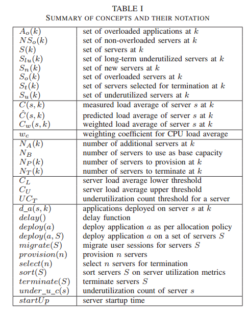
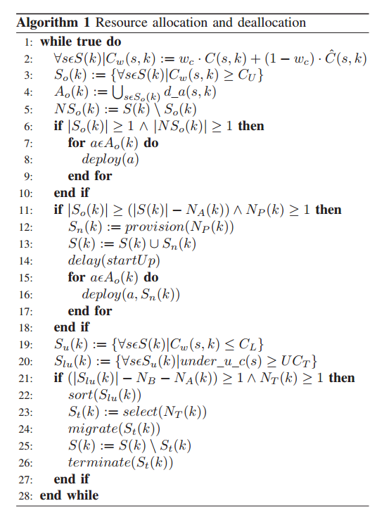
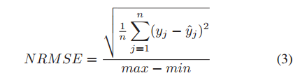

# 控制论

标签：控制论 微服务

## CRAMP: Cost-Efficient Resource Allocation for Multiple Web Applications with Proactive Scaling

### II. CRAMP Approach

主要任务：提供和移除VM，给指定VM配置和移除应用。

CRAMP最重要的特性在于它是基于主动控制的

#### A. Reactive and Proactive Resource Allocation

传统的很多资源分配手段是基于反应式的资源分配方式，对于突然的变化应对能力不强，只有在它检测到有突然的增加的时候它才会去分配资源。

CRAMP使用两部预测方法，综合了主动调节和反应式。

#### B. Shared Hosting

共享主机。原因在于有一些互联网应用人数很多的时候，另外一些互联网应用的用户可能非常少。因此，CRAMP就共享这些VM的资源。

#### C. QoS in Terms of Resource Utilization Metrics

QoS，Quality of Service服务质量，一般用一些软件表现指标来定义，比如响应时间和吞吐量。

然而一个应用对于不同的请求类型，期望响应时间也会有所差别。

被提议的资源分配方式使用了两个实用指标：CPU平均负载和内存使用率。

### III. System Architecture

系统架构暂时忽略（不算特别重要）

CRAMP方法提供了一种算法来主动地在应用服务器层进行资源分配，一种算法来动态弹性伸缩web应用。

资源分配的决策是基于应用服务器的状态来进行的，状态被平均负载和内存使用情况的上界来定义。这个上界是依据QoS和花费来确定的。如果超过上界，则称状态为超载(overload)，此外还有non-overloaded没有超载,underutilized空闲,long-term underutilized长期空闲

算法的主要目标就是维护一个最小的服务器数量$N_B$提供基础的流量。而且为了保证应对突然的流量增加，会有一小部分额外的服务器留存。额外服务器的数量称为$N_A(k)$。额外的服务器数量是由总服务器数量决定的。

算法的设计目标是为了避免抖动，因此，算法会延迟新的弹性操作，直到之前的弹性操作被意识到(原文：Therefore, the algorithm counteracts oscillations by delaying new scaling operations until previous scaling operations have been realized)。

提供的VM：

* $N_P(k)$是可以提供的虚拟机数量，$N_P(k)=floor(P_P(k)+D_P(k))$
* $P_P(k)$是比例系数(proportional factor)
* $D_P(k)$是导数参数(derivative factor)，$D_P(k)=|S_o(k)|-|S_o(k-1)|$

其中$P_P(k) = |S_o(k)|*A_p$，$S_o(k)$是超载服务器的数量，$A_p$是一个0~1的实数。当$A_p=1$的时候，它建议提供与超载服务器一样多的新服务器。

终结的VM：

* $N_T(k)$是停止的VM数量。$N_T(k)=floor(P_T(k)+D_T(k))-N_B-N_A(k)$
* $P_T(k)$是比例系数(proportional factor)，其中$P_T(k)=|S_{lu}(k)|*A_T$，而$A_T$是0~1的实数。
* $D_T(k)$是导数参数(derivative factor),$D_T(k)=|S_{lu}(k)|-|S_{lu}(k-1)|$
* $S_{lu}(k)$是长时间未充分利用的服务器数量

其他概念的汇总在这里。

算法的描述

* 第二行：处理监控信息，并给出预测。对于所有的测量信息和预测信息进行加权，权值$w_c$是一个0~1的实数，与CPU负载均值相关，它的计算是基于公式3.

其中$y_j$是测量值，$y_j'$为预测值，n是观测值的数目，max和min分别是测量值与预测值中的最大和最小值。$C_w(s,k)$由每个服务器的状态决定。

* 第三行：标记，对于所有资源利用率大于上界的服务器，将它们加入到overloaded集合中
* 第四行：标记，对于所有在overloaded state的服务器中运行的应用，认为其为overloaded的应用。
* 第五行：$NS_o(k)$即为没有overloaded的服务器
* 第6-10行：如果存在一个超载服务器和一个没有超载的服务器，就将超载服务器中的一个超载应用移动到没有超载的服务器中。
* 第11-18行：如果除了预留的服务器$N_A(k)$之外的所有服务器都超载了，那么算法将新增加一些服务器，并将超载的应用分配到新的服务器上。
* 19行：构建未充分利用集合$S_u(k)$
* 20行：构建长期未充分利用集合$S_lu(k)$
* 21-27行：因为算法的目标就是为了减少虚拟机的运行消耗，因此如果有多余的虚拟机，就应该尽快关闭。因此，如果算法找到至少一台长时间未充分利用的虚拟机，就会开始按照资源利用率升序排序，并删掉$N_T(k)$台虚拟机，将删除虚拟机中的应用进行迁移。

### V. Prototype and experimental results

加入了主动策略的算法效果不错。可能会出现最大负载超过1的情况，原因是缺乏进入控制，会导致服务器在进行VM提供操作时造成暂时性的超载。

对照组没有进行主动式的策略，所以响应时间和最大负载均衡大幅上升。这证明了CRAMP能够显著地提升QoS。