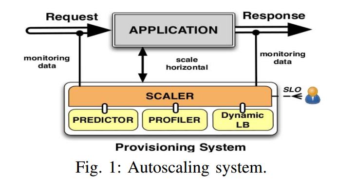
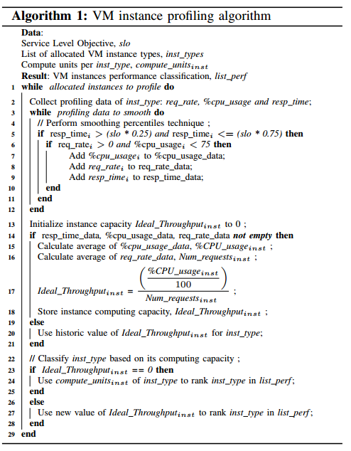
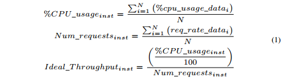
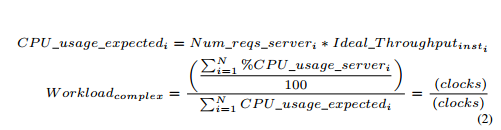
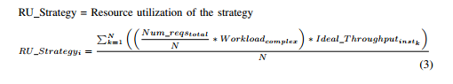
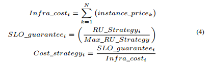
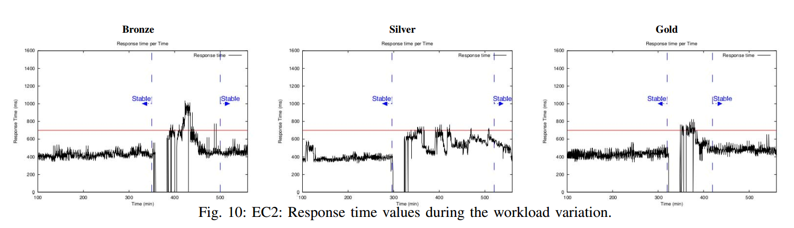
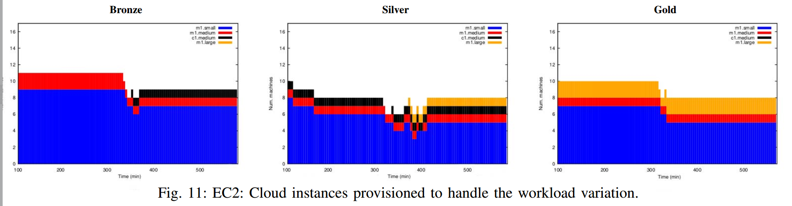

# 水平自动伸缩系统

标签：论文阅读 微服务 水平自动伸缩系统

## Autoscaling Web Applications in Heterogeneous Cloud Infrastructures

2014 IEEE International Conference on Cloud Engineering

Hector Fernandez, Guillaume Pierre, Thilo Kielmann

面对的问题：如何提供多样化的云基础设施

其他类似策略的缺点：

1. 限制自己只提供一种类型的资源
2. 不能够在极端的负载情况下满足QoS要求
3. 对所有用户提供相同的QoS级别，无论他们是否需要更多。

结构：

* Section II 讨论相关工作
* Section III 展现自动伸缩系统的方法
* Section IV 解释系统如何工作
* Section V 展现实验性评估
* Section VI 总结和未来的工作。

### III. Autoscaling system architecture

* Profiler（探查器）：设计目的是为了在应用运行时确定不同硬件配置的运算能力（this component was designed to measure the computing capacity of different hardware c onfigurations when running an application）。为了实现这一点，它为每种资源类型（下列的VM实例）创建了简要轮廓。这种每个实例都有的轮廓(profile per-instance type)提高了弹性伸缩动作的准确性。因此，探查器可以计算出每个提供资源类型的优化吞吐量(optimized throughput)。

这里的优化吞吐量是一个用于性能模式，在该模式下资源可以确保QoS要求，避免过分配或者不分配（under/over-utilization）

* Predictor预测器：为了提前避免违反SLA，使用负载预测策略来预测将要到来的流量。预测器将监控数据作为输入，使用不同的时间序列分析技术来预测下一个监控窗口(monitoring window)中未来的服务需求。使用了五种统计模型来应对四种工作流负载：1. 线型回归来预测线型趋势；2. 自动回归平移（auto regression moving average,ARMA）来应对线型小幅震动数据；3.Exponential Smoothing Holt Winter来应对每天和季节性数据；4.Autoregression和Vector Autoregression来面对相关趋势(correlated trends)
* Dynamic load balancer动态负载均衡器：为了应对不同的请求和云资源，这个组件基于每个配置资源的性能，动态地调整后端服务器的权重来分配到来的流量。
* Scaler：这个组件负责管理弹性伸缩系统，使用Predictor和Profiler来寻找实现预建立SLO的弹性伸缩计划，实现用户偏好。不仅如此，这个组件还分析每个提供的VM的行为，在必要的时候触发负载均衡器。

下面的内容注重回答when to scale和which scaling plan to choose的问题。

### IV. Provisioning on demand

按需供应

Scaler负责执行弹性伸缩策略，支持水平伸缩来添加或删除一个应用的资源。水平伸缩支持创建一个VM集群来关联到一个应用上，这个集群的大小会动态地变更。

通过下面的弹性行为进行：

* Scale out：当系统状态超过上界的时候，且Predictor确认这个状态将会持续到下个监控窗口时，添加资源。（本试验中，监控窗口大小为5分钟）
* Scale back：当监控系统状态低于下界，且Predictor确认这个状态将会持续到至少下个监控窗口，回收资源。

这些行为的逻辑回答了什么时候执行伸缩操作的问题。但是，最重要的是执行合适的伸缩计划。伸缩计划的选择包括资源配置的合理组合，且需要满足QoS的需要。Scaler遵循下列过程来扩展：

1. Measure the Resource performance（量化目标资源的表现）
2. Monitor workload and generate medium-term predictions（监控负载变化，产生中途的预测）
3. Select the optimal scaling plan based on the tradeoff cost/SLO gurantee（权衡成本/SLO保证来选择最好的伸缩计划）

#### A.Measuring VM instance performance

算法1的大致内容：一旦Sclaer决定执行一个伸缩计划，Profiler将根据以下步骤评估分配资源的吞吐量。

* a. Collection of monitoring date：Profiler会收集最近一小时内每一个VM实例类型的监控数据（collects the latest hour of monitoring data from each allocated VM instance type.），监控数据包括CPU使用率比例和响应时间。其他的一些参数，比如网络带宽和内存使用率也是可以被收集的。
* b. Data Smoothing：Profiler对收集到的数据进行平滑操作来去除那些因为极端负载情况（traffic spikes）而产生的噪音。这项技术允许识别每个实例的理想吞吐量，同时强制执行性能要求并避免CPU饱和。特别地，profiler将SLO阈值范围在25%-75%的响应时间，以及CPU使用率低于75%的那些点提取出来。（CPU使用率为75%，因为CPU使用率低并不意味着没有SLA违约）
* c.Instance performance classification实例表现分类:Profiler根据计算能力对不同的实例类型进行分类。使用经过平滑后的数据来进行计算

一些参数：

* $Ideal\_Throughput_{inst}$，表示处理特定数量的请求所需要的CPU时间(clock/requests)
* $\%CPU\_usage_{inst}$，代表CPU的平均使用率
* $Num\_request_{inst}$，代表请求速率的平均数

等式1（只在稳定状态有效）

$Ideal\_Throughput_{inst}$在处理当前工作负载时，给出了一个VM实例优化性能容量的估计。这个值越低，说明容量越高。

#### B. Scaling plan decision-making

为了考虑合适的伸缩计划，需要考虑下面三个方面：工作负载需求、资源种类和用户偏好。

如何选择合适的弹性伸缩计划：

##### 1. Analysis of the workload requirements

分析工作负载需求，Scaler需要考虑到Web应用的多样性。传统的分配方式考虑监控数据中请求量和CPU使用率来确认工作负载需求，但是这样子容易受到突然负载变化的影响。作为结果，我们的系统计算出工作负载复杂性(workload complexity)，将CPU使用率和当前弹性计划的请求速率作为参数来得出最后的响应时间。

一些参数：

* $Workload_{complex}$，指workload complexity。workload complexity的定义是一个参数，确定当前工作负载对已分配资源的理想性能行为的影响程度。
* $Num\_reqs\_server_i$，指请求速率(request rate)
* $\%CPU\_usage\_server_i$，在一个监控窗口内被分配的N台资源使用的CPU使用率的总比值(total percentage of CPU usage)
* $CPU\_usage\_expected_i$，CPU使用期望，由等式2计算出来。

$Workload_{complex}$是一个比例，使用处理当前工作负载的CPU使用率之和与期望的CPU使用率之和的比值计算得来。

##### 2. Calculating the different scaling plans 
计算不同的弹性伸缩计划：

为了决定应该增加或释放的VM的类型和数量，Scaler会使用一个最优决策树来进行计算，操控所有可能的弹性计划的发现。通过遍历这棵树，我们的系统使用水平弹性伸缩策略来评价所有可能的资源组合。

在选择可能的弹性策略时，Scaler使用了等式3来计算策略在考虑到性能容量的时候，应该如何在不同资源中分配当前的工作负载。

一些参数：

* $RU\_strategy$，用来决定处理当前工作负载时策略的资源使用情况。它明确了在特定的资源组合下用来处理当前工作负载的资源的使用率(clock)。
* $Num\_reqs_{total}$，被Predictor提供或估计的总请求数

计算通过N个资源上分配总请求数与N个资源上工作负载复杂度的乘积，乘以N个资源上不同的优化吞吐量后求和。

注意，貌似可信的策略的搜索空间是可以非常大的，因此Scaler需要采取下面两个原则来筛选可行的策略：

* Define the maximum resource utilization consumed by a strategy when processing a particular workload.定义处理特定工作负载策略时所需要的最大资源利用率，也就是上界($Max\_RU\_Strategy_i$)。$Max\_RU\_Strategy_i$指的是应用程序开始经历SLOW违约或是资源过度使用时的资源最大使用率。可以从Amazon EC2建议最大CPU使用率中提取，或是基于经历SLO违约时的监控数据来进行。
* Include a cost policy to avoid choosing wasteful scaling strategies.使用一个成本政策来避免选择浪费的扩展策略。Scaler使用成本政策来拒绝策略释放短时间内刚启动的资源(大于5分钟，小于20分钟)

上述两个原则用来避免短时间内触发新的弹性伸缩动作。

总而言之，用等式3可以回答提供资源的数量和类型问题。

##### 3.Selecting the optimal scaling plan

选择最佳的弹性伸缩计划

一旦Scaler拥有了一个可行的弹性伸缩策略列表，它会开始根据SLO保证和基础设施花费来计算每一个可能的策略的耗费。

一些参数：

* $Infra\_cost$，infrastructure cost，基础设施花费，指的是为下一个小时提供扩展计划所需要的成本。
* $SLO\_guarantee$，指的是弹性计划在经历SLO违约时的脆弱性(vulnerability)，使用每个策略的$RU\_Strategy_i$来进行计算。$RU\_Strategy_i$的值越大，意味着在出现负载抖动的情况下SLO违约的可能性越大。

为了处理用户对于性能和花费的偏好，我们的系统采用了不同的预定义原则来采取弹性伸缩决定。这些选择原则被成为奖章分类法，能够将资源分成不同的QoS层级，基于用户的性能、花费偏好。

开始的时候定义了三种QoS级别给用户。

* Gold QoS级别，用户愿意付出更多来取得最好的服务来应对一些超出分配资源的情况。sclaer选择`Cost_strategy`最高的策略
* Silver QoS级别，用户愿意在合理的操作代价内维护一个高可用的服务，会选择中等的`Cost_strategy`策略
* Brozen Qos级别，用户愿意为一个缩水的、可接受的、满足SLO但是可以稍微超出保证的资源付费，价格低廉，会选择可选范围内最低的`Cost_strategy`策略。

### V.Evaluation

测试的参数：监控窗口monitoring window为5分钟，弹性伸缩的最小冷却时间为10分钟，SLO为服务端固定700ms的响应时间。

#### A. public Cloud

1. Performance stability and SLO fulfillment:用来处理这个峰值的用户采用的QoS级别越高，效果越好，重新恢复稳定的时间越短。

2. Resource utilization: 作者的观点是，如果系统分配了不足的硬件配置，那会更容易造成系统的性能下降并最终导致响应时间的上升。图中可以看到，随着QoS级别的增长，分配的系统级别是不断上升的，稳定性自然是不断提高的。
3. 结果的分析：显然，铜牌级的QoS过于脆弱，很容易在暴增的工作负载下变得不稳定。当使用混合的QoS策略比如银牌时，Scaler会在表现和费用之间权衡，组合不同的硬件组合来使其能够处理这个负载条件。但是这个组合可能很难被找到，最终影响到服务器的稳定性。而金牌级别毫无疑问有着最优的表现，可以比较好地满足SLO要求。

### VI. Conclusion

奖牌分类法可以让用户自行决定自己的SLO保证与费用的平衡关系，来更好地适应他们的需求。

未来，希望支持更多的硬件设置，提供更有效地动态平衡机制。