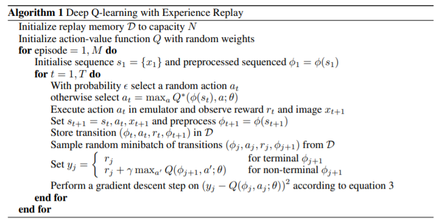

# 强化学习DQN

## 相关资料

* [stable-baseline](https://stable-baselines.readthedocs.io/en/master/modules/dqn.html),openAI的相关项目，提供了对应的论文和代码。
* [莫凡python](https://mofanpy.com/tutorials/machine-learning/reinforcement-learning/intro-DQN/)
* [pytorch-DQN](https://pytorch.org/tutorials/intermediate/reinforcement_q_learning.html)
* [tensorflow2/keras-DQN](https://geektutu.com/post/tensorflow2-gym-dqn.html)


## 核心算法部分



算法解析：
1. 初始化状态，对于每一个episode的每一个t（即每一次训练的每一步）
2. 首先使用在Q-Learning中同款的$\epsilon$-greedy算法，以$\epsilon$的概率选择随机动作，否则则选择当前状态下的最优动作（Q值最大的动作）
3. 执行步骤2中选择的动作，观察环境，得到奖励值$r$和下一个图像$x_{t+1}$
4. 将图像进行预处理，并设定状态
5. 将这一步的信息存储到信息库中
6. 从信息库中选取随机的一组样本进行训练
7. 对y进行训练
8. 开始梯度下降，并将所得到的梯度用来更新神经网络

与Q-Learning的区别：
1. 加上了记忆库，用于重复学习
2. 使用神经网络来计算Q值，而非直接用表格记录
3. 暂时冻结q_target参数，使用一个过去的神经网络来计算bellman方程中的最佳Q值，用于切断相关性。防止某一个近期执行过于频繁的动作受到影响导致值过大。

神经网络的作用：对于deepRL而言，神经网络有两种实现。一种是输入状态和动作，输出Q值，相当于替代了Q-table；另一种是输入状态，输出动作和Q值，相当于policy。

我个人以为比较难实现的部分：
* 如何对状态进行初始化，或者说，如何将图像转换为状态

可以优化的地方：
1. 目前我所看见的状态产生方法都是基于单张图片的，但是这可能会造成歧义，不如说从左往右和从右往左都是一样的。这样的话，我认为将多张连续图片放在一起考虑会更合适，比如说使用ConvLSTM2D作为MLP的中间层
2. 奖励函数的设计。目前初步的考虑是得分+100，失分-100，存活+1，但是这样的奖励函数是否效果好是值得考虑的，需要参考其他实现与原论文
3. 其他超参数选择，比如一个episode多少个time，多少个time更新以此Q-target，epsilon是否使用固定值还是逐渐取小。损失率怎么取，还是说分开测试

## openai

* [openai-doc](https://gym.openai.com/docs/)

### 环境

主要使用Atari game

方法：
可以观察

off-screen

### Observation

environment.step会返回我们所需要的观察值，包括
* observation,object 一个环境特化的对象，代表对环境的观察结果。
* reward, float 之前动作的奖励值
* done, boolean 指导是否应该重置环境。
* info, dict 用于指导debug的信息，agent不应该使用这里面的信息。

例子
```python
import gym
env = gym.make('CartPole-v0')
for i_episode in range(20):
    observation = env.reset() # 通过reset开始
    for t in range(100):
        env.render()
        print(observation)
        action = env.action_space.sample()
        observation, reward, done, info = env.step(action)
        if done:
            print("Episode finished after {} timesteps".format(t+1))
            break
env.close()
```

### space

上述代码中使用`env.action_space.sample()`来获得动作空间中的一个随机动作。

空间包括动作空间action_space和环境空间observation_space。它们都是Space类型的对象，类型有Discrete离散值、Box-n维值

可以直接覆盖原env的空间

```python
from gym import spaces
space = spaces.Discrete(8) # Set with 8 elements {0, 1, 2, ..., 7}
x = space.sample()
assert space.contains(x)
assert space.n == 8
```

## trick

rainbow