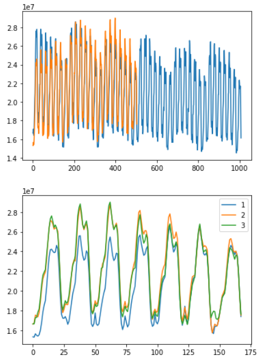
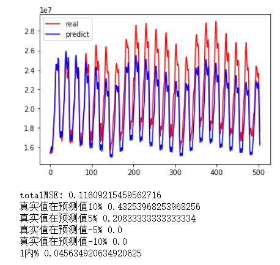
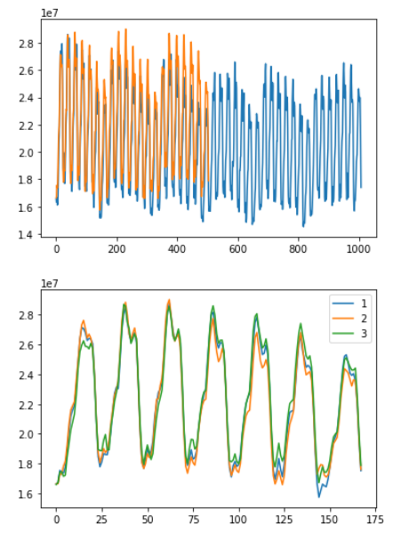

# 时间序列预测实验

更新模型

模型的测试数据要充分考虑到数据本身的特征：
* 第一组：要求稳定，至少三个
* 第二组：要求SVR无法正确处理，即每组内不稳定，至少三个

以上为六个测试的时间点。需要注意的是第二组中的时间点必须是SVR无法处理且神经网络能够处理的，即不能是那种因为前面特征原因导致后面无法预测的，那种神仙都预测不了。

具体来说，就是足够复杂使得后面无法预测，但是又不够复杂使得具备预测的可能性，需要具体进行测试。

## 参数测试内容

标准测试选择14->7与42->21

1. epch参数，测试50、100、200、400等的情况，与batch_size联动探索
2. input->output：当前选择的是7*24->2*24，有没有其他选择
3. 神经网络模型的探索，比如使用双层CNN提取、三层LSTM解码等
4. 其他一些参数设置。

## 0616实验内容

测试150、350、650、1050和1350的属性，进行分类，并且加入新的。确保有三个能被SVR处理，且有三个不能被SVR处理。

补充实验

## 有趣的结果

### 数据选择与准确预测

经过多次实验看，发现实验的结果不仅取决于模型，而更多取决于数据本身。可以将数据分为可准确预测和不可准确预测两种。

可以预测的情况有两类，一类是非常容易预测，比如startHour=650的情况，代表性是可以用SVR这样的简单模型得到很好的结果。

其中1196是介于两者之间的，它在训练数据的最后一周存在问题，因此权值影响很大。但是LSTM模型能够比较好的处理好这个点。

#### 不可能准确预测

长期预测中存在着不可能准确预测的情况，即在周均值发生改变的时候。

上图为startHour为340的时候，训练时间42天，测试时间21天的小时级别数据，使用SVR快速方法。

显然，第一周的数据是偏小的，这时候要求模型不仅能够学习到模式，同时能够预测到走向，但这是不切实际的，因为缺少必要的数据。

所以，不可能有一个模型来完成这个需求。训练出的模型在测试的时候一定会在第一周的时候进行低估，从而影响到后面的结果。

#### 可以预测的情况

承接上面的实验，在startHour=347的时候，预测的部分非常接近，此时需要模型能够正确处理前面的训练数据，得到比较好的结果。从历史数据来看，普通方法比较难以处理这种情况，而时间序列提取方法可以较好的处理。

### 参数调整

#### 过拟合

通过添加dropout层可以有效解决过拟合的问题。一般来说，输入RNN的dropout=0.1，输出RNN的dropout=0.5

另外这个过拟合的情况比较奇怪，似乎受到随机因素的影响比较大。

#### 一些改进网络的想法

双向LSTM+Attention:https://www.jianshu.com/p/31c0acf94e0e

使用自定义库的Attention seq2seq:https://blog.csdn.net/qq_42189083/article/details/89336115

Keras TCN:https://github.com/philipperemy/keras-tcn

Keras-self-attention package in time series forecast case,stackoverflow:https://stackoverflow.com/questions/58356868/how-visualize-attention-lstm-using-keras-self-attention-package

简单LSTM的超参数设置：https://towardsdatascience.com/choosing-the-right-hyperparameters-for-a-simple-lstm-using-keras-f8e9ed76f046

batch normalization in CNN-LSTM architecture:https://stackoverflow.com/questions/59285058/batch-normalization-layer-for-cnn-lstm

时序数据的特征工程：https://www.jianshu.com/p/4ece90357020