# 周博磊强化学习
标签：周博磊 强化学习 视频课程

[B站](https://space.bilibili.com/511221970/video)

[代码](github.com/metalbubble/RLexample)

1. [周博磊强化学习](#周博磊强化学习)
   1. [第一课 概括与基础下](#第一课-概括与基础下)
      1. [Policy](#policy)
      2. [Value function](#value-function)
      3. [Model](#model)
      4. [Exploration and exploitation](#exploration-and-exploitation)
      5. [实验](#实验)
      6. [作业](#作业)
   2. [第二课 马尔科夫决策过程上](#第二课-马尔科夫决策过程上)
      1. [计算MDP的三种方法](#计算mdp的三种方法)
         1. [蒙特卡洛方法](#蒙特卡洛方法)
         2. [动态规划方法](#动态规划方法)
      2. [Markov Decision Process](#markov-decision-process)
      3. [Policy Evaluation](#policy-evaluation)
   3. [第二课 马尔科夫决策过程 下](#第二课-马尔科夫决策过程-下)
      1. [Decision making in Markov Decision Process (MDP)](#decision-making-in-markov-decision-process-mdp)
      2. [Policy evaluation on MDP](#policy-evaluation-on-mdp)
      3. [Optimal Value Function](#optimal-value-function)
         1. [MDP Control](#mdp-control)
         2. [Policy Iteration](#policy-iteration)
         3. [Policy Improvement](#policy-improvement)
         4. [value iteration](#value-iteration)
         5. [例子](#例子)

## 第一课 概括与基础下

强化学习的目的：最大化长期奖励

根据智能体能看到的状态可以分为两种情况：
* Full observability：智能体可以看到所有的环境状态，比如马尔科夫决策过程MDP
* Partial observability：只能部分观测到环境，Parital Observce MDP

RL agent的组成：
* policy：Agent's behaviour function
* value function: how good is each state or action
* model: agent's state representation of the environment

### Policy

策略是智能体的决策模型，是一个从状态到动作的映射。

有两种策略：
* Stochastic policy：给出的是所有行为的一个概率$\pi (a|s) = P[A_t=a|S_t=s]$
* Deterministic policy:$a^*=argmax_a\pi(a|s)$

以雅达利游戏为例，输入为每一帧的图像，输出为往上走或往下走两个动作

### Value function

价值函数：折扣的未来奖励的加和，即进行行为之后未来可以获得什么样的奖励。

我们的目的是在尽量少的时间内尽可能多的获得奖励，因此要有折扣率。

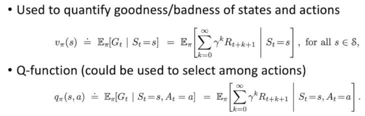

Q函数用来选择最佳的动作

### Model

模型根据当前状态和动作进行状态转移。

另一个组成是奖励函数，在当前状态下采取某个行为会获得什么样的奖励。

例子：走迷宫
* 每走一步奖励-1
* 动作为上下左右

根据已知和未知可以分为三种Agent

Value-based agent
* Explicit:价值函数
* Implicit:策略（可以根据价值函数推断）

Policy-based agent:
* Explicit:策略
* No value function

Actor-Critic agent:
* Explicit: policy and value function

另外可以根据Agent是否有环境模型来分类（是否对状态转移去进行估计，或者对环境进行建模）

Model-based
* Explicit: model
* may or may not have policy and/or value function

Model-free
* Explicit: value function and/or policy function
* No model

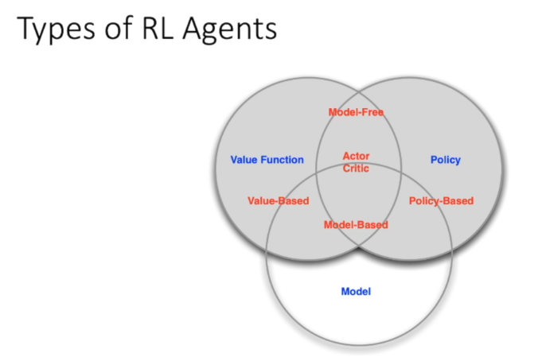

### Exploration and exploitation

智能体只能通过试错来理解采取行为后的奖励。

* Exploration: 尝试新事物，探索未知
* Exploitation：只选择已知的最优解

trade-off: 如何牺牲短期的奖励来获得长期最优解

### 实验

强化学习是理论与实现相结合的学科，最终结果都需要落在实践上，通过实践来证明。

环境：
* [OpenAI gym library](https://gym.openai.com)
* [Gym Retro](https://github.com/openai/retro)

CartPole环境
* 动作：左移、右移
* 状态：杆的位置、杆的移动速度、杆的角度
* 奖励：尽可能长的存活

### 作业

[Pong from pixel](http://karpathy.github.io/2016/05/31/rl/)，深度强化学习

## 第二课 马尔科夫决策过程上

马尔科夫决策过程中对环境是全可观测的，但是部分可观测环境也可以建立马尔科夫。

马尔科夫性质：一个状态是马尔科夫的，当且仅当其只受过去状态的影响

马尔科夫奖励过程：马尔科夫链+奖励函数，奖励函数是一个期望，在到达某个状态之后能获得多少奖励。

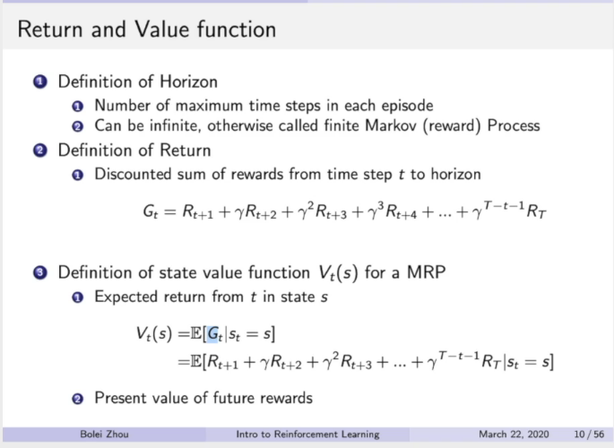

Return是当前获得的价值，Reward是一次获得的奖励，return是reward的期望，value是return的期望

为什么需要折扣系数Discount Factor：
1. 避免带环的马尔科夫链
2. 表示出不确定性，希望尽可能快的得到奖励
3. 对立刻奖励的偏向性
4. 当系数=0时，只关系当前奖励；系数=1时，未来奖励与现在奖励相同。

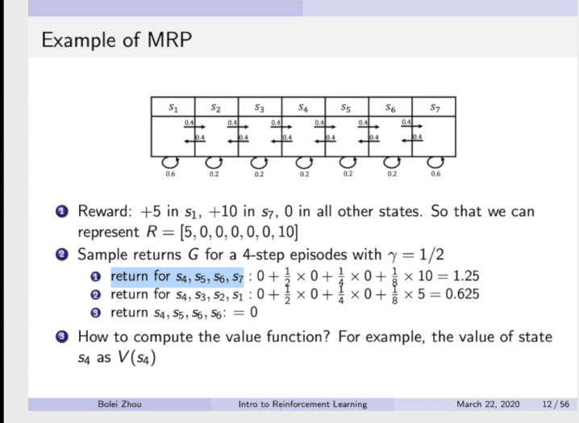

return的计算如上，那value of state该如何计算？

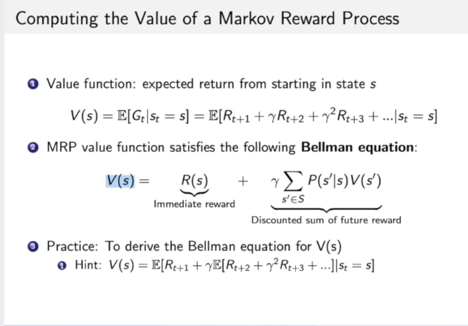

BellmanEquation：当前状态的价值 = 当前状态的奖励+未来的折扣奖励和

定义了状态之间的迭代关系

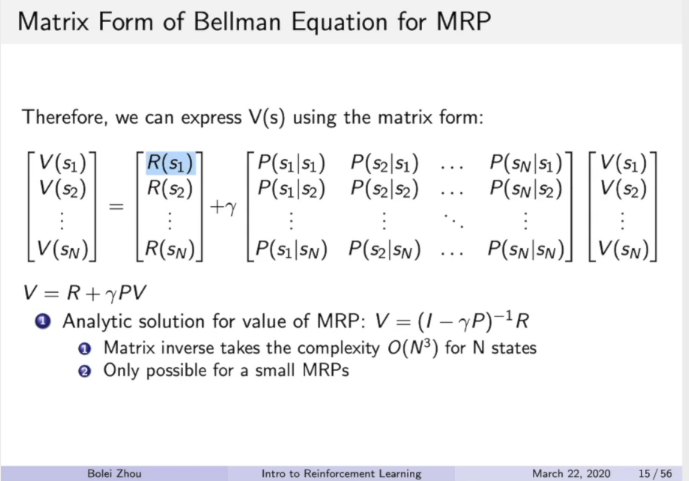

直接通过矩阵求逆可以解出V，但是矩阵求逆的计算量是O(n^3)

### 计算MDP的三种方法

只能用迭代方法来计算状态较多的马尔科夫过程：
1. 动态规划
2. 蒙特卡洛方法
3. Temporal-Difference learning（1与2的结合）

#### 蒙特卡洛方法

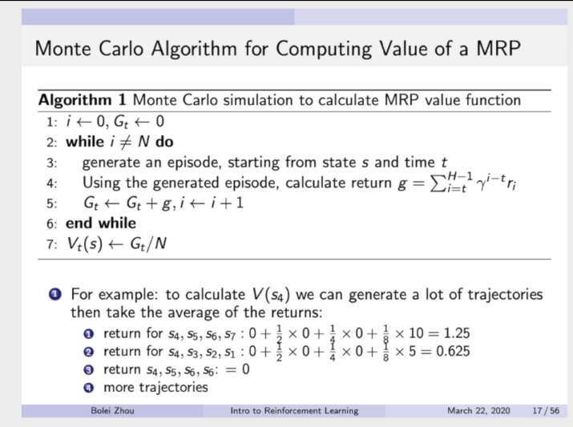

一次轨迹作为一次采样，在轨迹底部更新过去的状态。相当于模拟

#### 动态规划方法

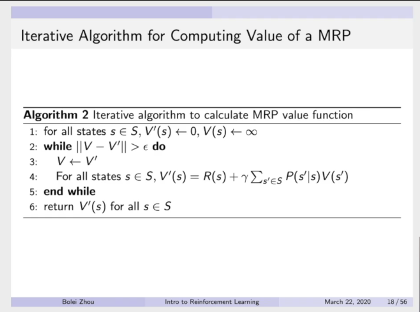

利用Bellman Equation进行状态转移，并不断更新状态值。

### Markov Decision Process

与奖励过程不同，有一个决策过程：当前状态与在当前状态所采取的行为共同决定未来状态的走向。

Policy:定义了在每个状态应该采取什么样的行为，是一个概率的表示（70%往左走，30%往右走），或者也可以是一个值。

这个概率函数是静态的，不同时间点的决策实际上都是对同一个概率函数进行采样。

马尔科夫决策过程与马尔科夫奖励过程的转换：
已经知道Policy的时候可以进行

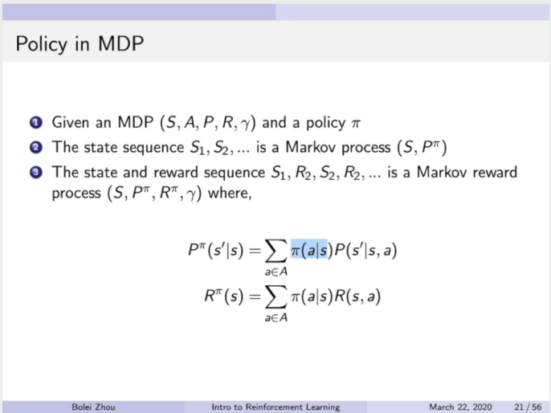

下图很好的说明了如何计算是V(s)

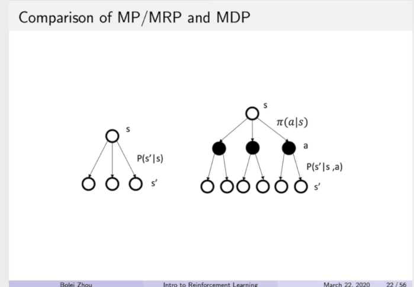

可以对MDP中的价值函数进行定义，与Policy相关

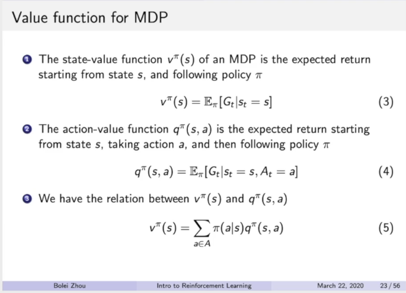

同时引入了Q函数，某一个状态、某一个行为得到某个奖励的期望

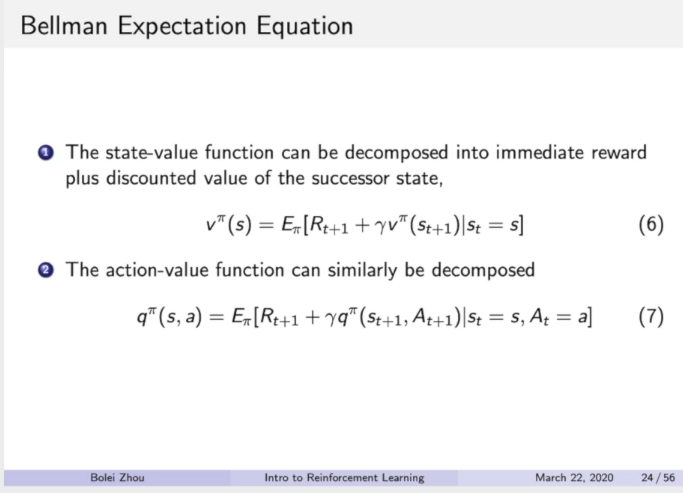

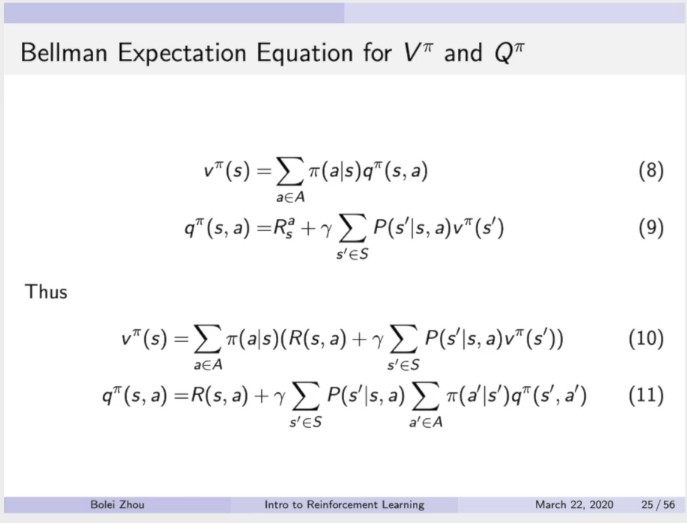

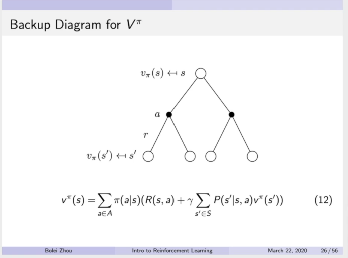

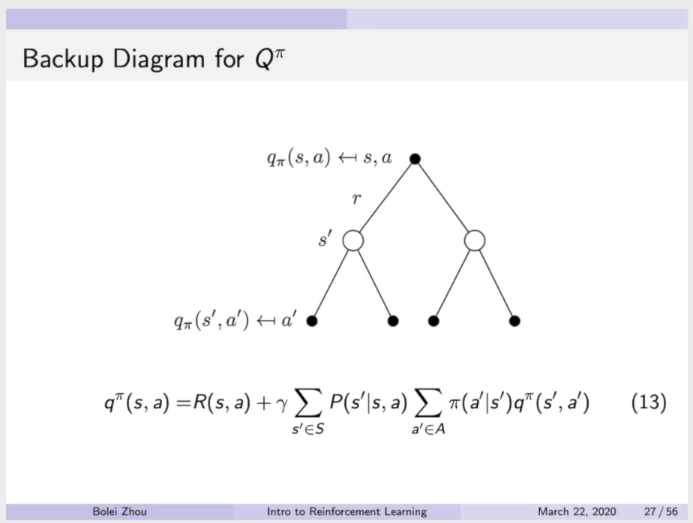

### Policy Evaluation

已经知道MDP和采取的策略，对策略进行评估，计算v^\pi(s)

## 第二课 马尔科夫决策过程 下

### Decision making in Markov Decision Process (MDP)

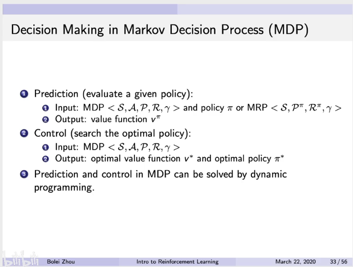

* Prediction：给定MDP和一个策略，输出value function（评价一个指定策略）
* Control：给定MDP，输出最佳的value function以及策略（找寻最佳的策略）

上述两点都可以通过动态规划来解决

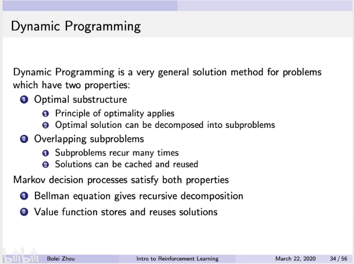

动态规划：将问题分解成最佳子结构，将子结构的解组成最优解

马尔科夫过程符合上述性质，只要子状态能够得到一个值，未来状态可以推断出来。

### Policy evaluation on MDP

Policy Evaluation是什么？

给定MDP，给定policy，可以估算出价值函数V

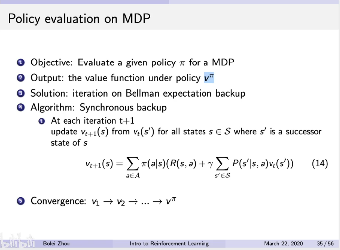

得到上一时刻的V(t)，可以得到下一时刻，反复迭代可以计算出最终结果（式14）

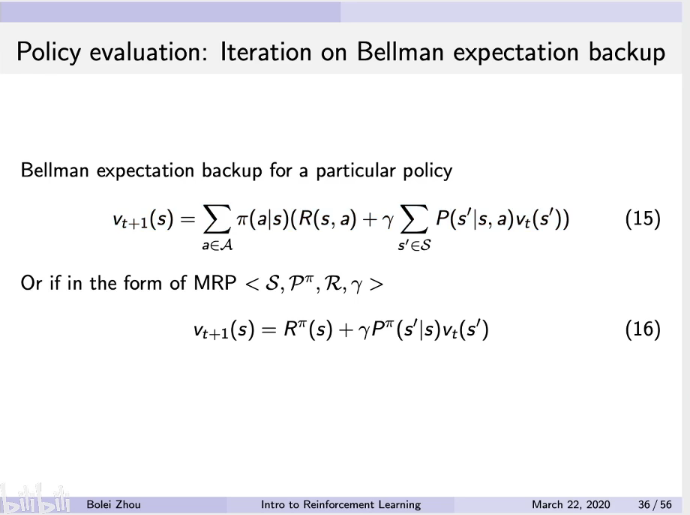

gridworld[例子](https://cs.stanford.edu/people/karpathy/reinforcejs/gridworld_dp.html)

### Optimal Value Function

没有MDP，去搜索一种Policy，使得value最大。此时这个策略为最佳策略，称此MDP环境被解。

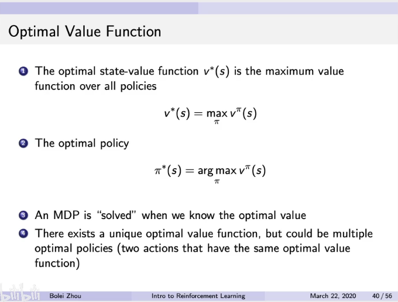

可以证明存在唯一的最佳价值，但不一定只有一个策略。

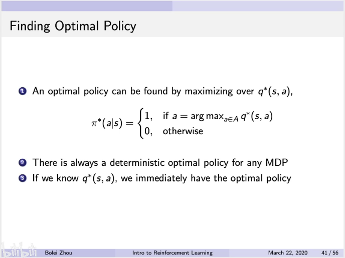

可以通过对Q函数极大化来获得最佳的价值。Q函数是关于状态和动作的函数，如果采取某种行为使Q函数最大化，则该行为为最佳的行为。、

一种策略方法是Policy Search

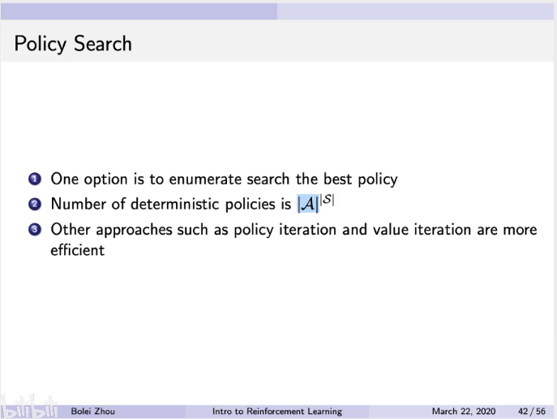

有有限种状态，直接穷举一遍，计算出value function，并进行对比。

问题是效率低下，而且不一定能够进行穷举

另外两种：policy iteration和value iteration

#### MDP Control

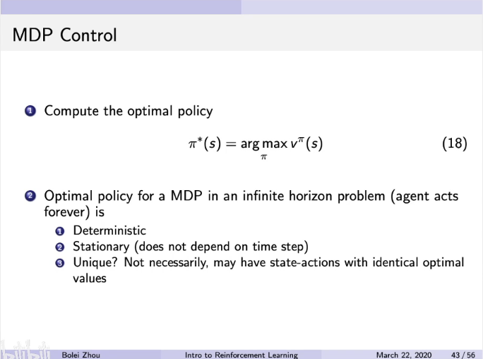

对于事先确定好的MDP过程，最佳策略是静态的、决定性的，但不一定是唯一的。

#### Policy Iteration

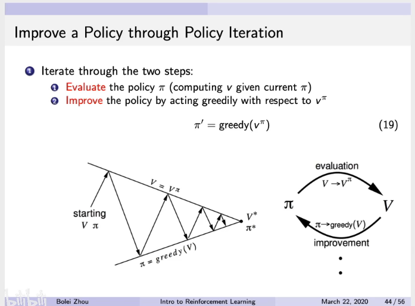

两个步骤：

1. Policy Evaluation，评价已有的策略，计算出V函数，推算出Q函数
2. 在Q函数上取极大化（贪心搜索），改进策略

迭代进行上述两个步骤，直到收敛

#### Policy Improvement

上面Policy Iteration的第二个步骤，根据Q函数改进策略。

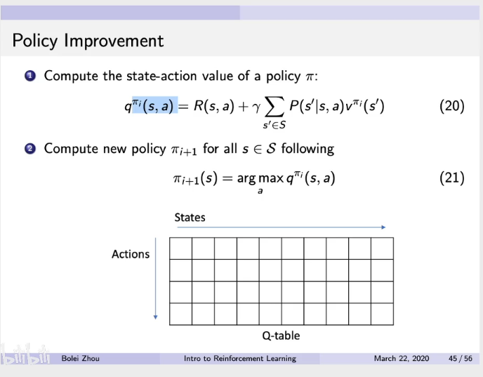

首先计算Q函数的最大值，然后基于此改进策略。

单调的递增过程如下，以上过程只会使得策略变得更好

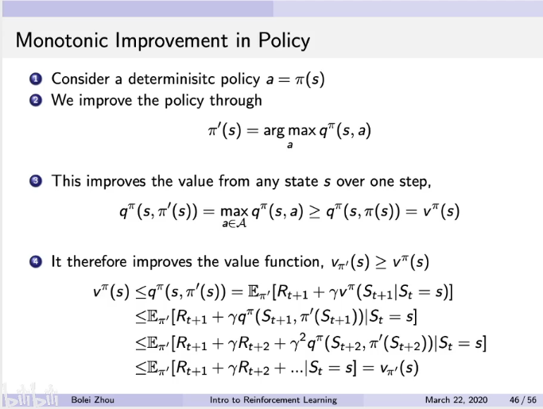

更新终止时，策略取得最优。

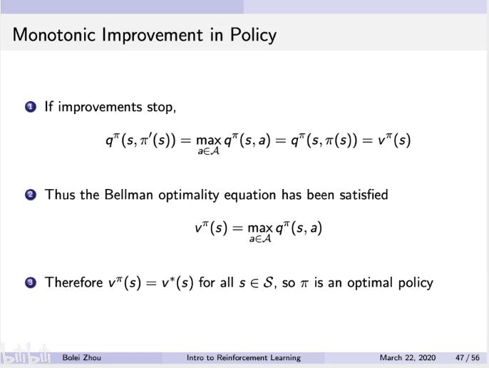

#### value iteration

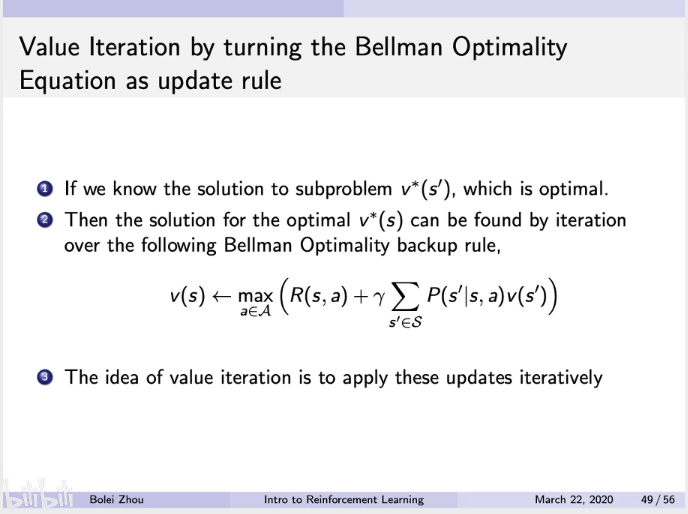

为了得到每个状态最大的Value V*(s)，直接进行迭代

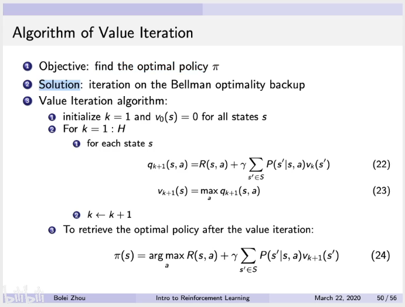

#### 例子

[FronzenLake](https://github.com/cuhkrlcourse/RLexample/tree/master/MDP)

[可视化](https://cs.stanford.edu/people/karpathy/reinforcejs/gridworld_dp.html)

Policy Iteration和Value Iteration的对比，都是对MDP Control问题的解法

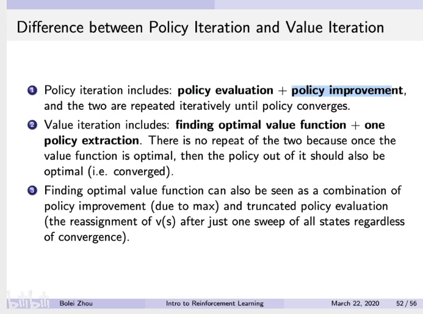

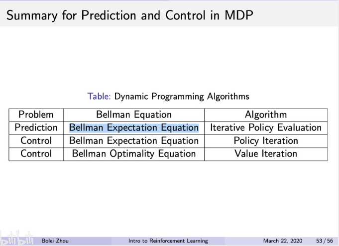

下节对应章节：第五章和第六章

[作业](https://github.com/cuhkrlcourse/ierg6130-assignment)

